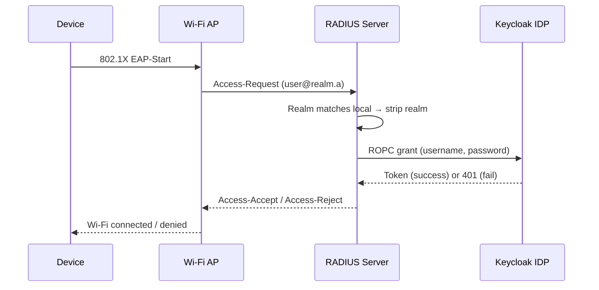
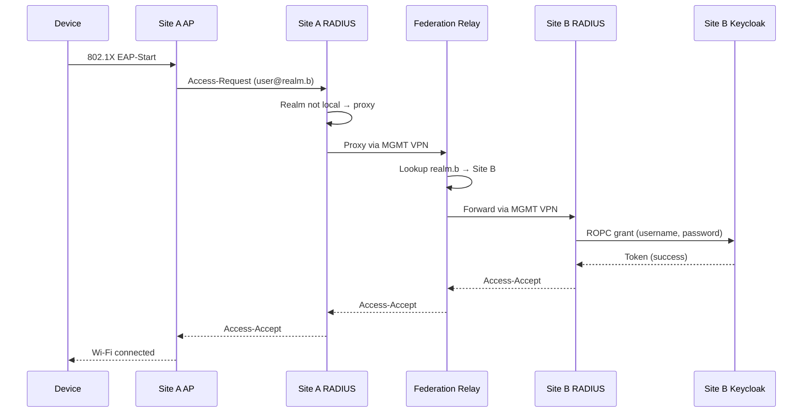

# Authentication Flow

FadianRoam uses **802.1X** enterprise Wi-Fi authentication with federated RADIUS proxying.

## Protocol Stack

```
┌─────────────────────────────────┐
│        Wi-Fi Supplicant         │  User device (laptop, phone)
├─────────────────────────────────┤
│        EAP-TTLS / PAP          │  Outer: TLS tunnel; Inner: plaintext password
├─────────────────────────────────┤
│        RADIUS (UDP 1812)        │  Authentication protocol
├─────────────────────────────────┤
│        Keycloak ROPC            │  Identity Provider validation
└─────────────────────────────────┘
```

## Authentication Steps

### Local User (Same Site)

A user connecting at their home site:



1. Device initiates 802.1X authentication
2. AP forwards EAP to local RADIUS server
3. RADIUS identifies `@realm.a` as local realm
4. RADIUS strips realm suffix, sends credentials to Keycloak via ROPC
5. Keycloak validates and returns result
6. RADIUS sends Access-Accept or Access-Reject

### Roaming User (Different Site)

A user from Site B connecting at Site A:



1. Device initiates 802.1X at Site A
2. Site A RADIUS sees `@realm.b` — not a local realm
3. Site A RADIUS proxies request to the **Federation Relay** over MGMT VPN
4. Relay looks up `realm.b` in its realm table and forwards to Site B's RADIUS
5. Site B RADIUS validates against its own Keycloak
6. Result flows back through the chain

## EAP Configuration

### Supported Methods

| Method | Support | Notes |
|--------|---------|-------|
| EAP-TTLS/PAP | **Required** | Primary method, simplest Keycloak integration |
| PEAP/MSCHAPv2 | Optional | Requires password hash storage in Keycloak |
| EAP-TLS | Optional | Certificate-based, no password needed |

### Why EAP-TTLS/PAP?

EAP-TTLS creates a TLS tunnel between the device and the RADIUS server. Inside this tunnel, credentials are sent as plaintext (PAP). This is secure because:

- The outer TLS tunnel encrypts everything over the air
- The RADIUS server decrypts and forwards to Keycloak via localhost
- Keycloak receives a standard ROPC (Resource Owner Password Credentials) grant
- No password hashing scheme compatibility issues

### TLS Certificate

Each member's RADIUS server needs a valid TLS certificate for the EAP outer tunnel:

- Must be issued by a **publicly trusted CA** (Let's Encrypt, ZeroSSL, etc.)
- Self-signed certificates cause connection failures on most devices
- Certificate CN/SAN should match the member's RADIUS domain
- Auto-renewal is strongly recommended

## Keycloak Integration

### ROPC Flow

FreeRADIUS communicates with Keycloak using the **Resource Owner Password Credentials** grant:

```
POST /realms/{realm}/protocol/openid-connect/token
Content-Type: application/x-www-form-urlencoded

client_id=freeradius
&client_secret=<secret>
&grant_type=password
&username=<stripped-username>
&password=<user-password>
&scope=openid
```

- **Success**: Keycloak returns an access token → RADIUS sends Access-Accept
- **Failure**: Keycloak returns 401 → RADIUS sends Access-Reject

### Realm Separation

Each member operates an independent Keycloak realm for roaming users:

- Realm is separate from any other services the member runs
- No user synchronization between members
- Each member controls their own user lifecycle (registration, suspension, deletion)

## Realm Naming

Each member registers a unique realm identifier with the federation:

- Format: `roam.example.net` or `member-name.fadianroam.net`
- Must be a valid DNS-style identifier
- Registered in the federation configuration repository
- Used for RADIUS realm routing (e.g., `user@roam.example.net`)

!!! warning "Realm Uniqueness"
    Realm names must be globally unique within the federation. The Federation Relay uses the realm to route authentication requests to the correct member.
