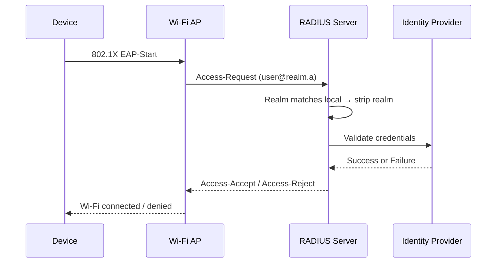
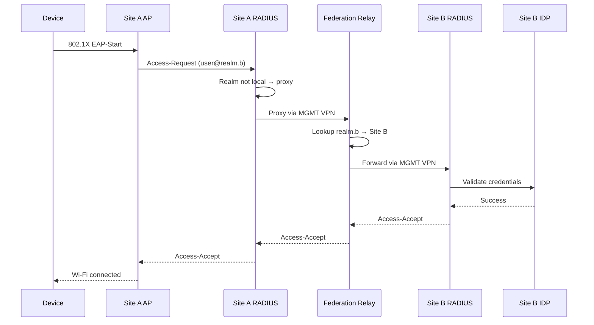

# Authentication Flow

FadianRoam uses **802.1X** enterprise Wi-Fi authentication with federated RADIUS proxying.

## Protocol Stack

```
┌─────────────────────────────────┐
│        Wi-Fi Supplicant         │  User device (laptop, phone)
├─────────────────────────────────┤
│        EAP-TTLS / PAP          │  Outer: TLS tunnel; Inner: plaintext password
├─────────────────────────────────┤
│        RADIUS (UDP 1812)        │  Authentication protocol
├─────────────────────────────────┤
│        Identity Provider        │  Credential validation
└─────────────────────────────────┘
```

## Authentication Steps

### Local User (Same Site)

A user connecting at their home site:



1. Device initiates 802.1X authentication
2. AP forwards EAP to local RADIUS server
3. RADIUS identifies `@realm.a` as local realm
4. RADIUS strips realm suffix, sends credentials to the Identity Provider
5. IDP validates and returns result
6. RADIUS sends Access-Accept or Access-Reject

### Roaming User (Different Site)

A user from Site B connecting at Site A:



1. Device initiates 802.1X at Site A
2. Site A RADIUS sees `@realm.b` — not a local realm
3. Site A RADIUS proxies request to the **Federation Relay** over MGMT VPN
4. Relay looks up `realm.b` in its realm table and forwards to Site B's RADIUS
5. Site B RADIUS validates against its own IDP
6. Result flows back through the chain

## EAP Configuration

### Supported Methods

| Method | Support | Notes |
|--------|---------|-------|
| EAP-TTLS/PAP | **Required** | Primary method, simplest IDP integration |
| PEAP/MSCHAPv2 | Optional | Requires password hash storage in IDP |
| EAP-TLS | Optional | Certificate-based, no password needed |

### Why EAP-TTLS/PAP?

EAP-TTLS creates a TLS tunnel between the device and the RADIUS server. Inside this tunnel, credentials are sent as plaintext (PAP). This is secure because:

- The outer TLS tunnel encrypts everything over the air
- The RADIUS server decrypts and forwards to the IDP via a local connection
- The IDP receives a standard credential verification request
- No password hashing scheme compatibility issues

### TLS Certificate

Each member's RADIUS server needs a valid TLS certificate for the EAP outer tunnel:

- Must be issued by a **publicly trusted CA**
- Self-signed certificates cause connection failures on most devices
- Certificate CN/SAN should match the member's RADIUS domain
- Auto-renewal is strongly recommended

## IDP Integration

### Credential Validation

The RADIUS server must be able to verify user credentials against the member's Identity Provider. The specific integration method (ROPC, LDAP, REST API, local database, etc.) is up to each member.

The key requirement is:

- RADIUS receives a username and password (from the inner EAP tunnel)
- RADIUS queries the IDP to validate these credentials
- IDP returns success or failure
- RADIUS sends Access-Accept or Access-Reject accordingly

### Identity Separation

Each member operates an independent identity system for their roaming users:

- No user synchronization between members
- Each member controls their own user lifecycle (registration, suspension, deletion)

## User Registration

Each FadianRoam Site (branch) independently manages user registration for its realm.

### Registration Policy

Each Site decides its own registration policy:

| Policy | Description |
|--------|-------------|
| **Open** | Anyone can register an account at the Site |
| **Invite-only** | Registration requires an invitation from the Site operator |
| **Closed** | No public registration; accounts created by administrator only |

The federation does not enforce a uniform policy — Sites are free to choose what fits their use case.

### User Identity

- Users register at a specific Site and receive credentials under that Site's realm
- Identity format: `username@site-realm` (e.g., `edward.sun@roam.yunzheng.space`)
- A user's credentials work at **any** FadianRoam AP worldwide via roaming
- The home Site is responsible for authenticating its own users, regardless of where they connect

### Roaming Rights

A user registered at any FadianRoam Site can connect at any other Site's AP. The home Site bears responsibility for its users' behavior and traffic.

## Realm Naming

Each member registers a unique realm identifier with the federation:

- Format: `roam.example.net` or `member-name.fadianroam.net`
- Must be a valid DNS-style identifier
- Registered in the federation configuration repository
- Used for RADIUS realm routing (e.g., `user@roam.example.net`)

!!! warning "Realm Uniqueness"
    Realm names must be globally unique within the federation. The Federation Relay uses the realm to route authentication requests to the correct member.
