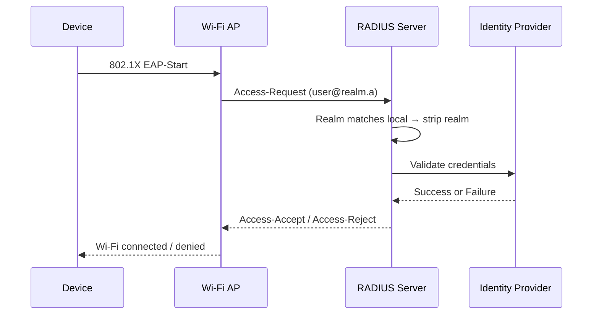
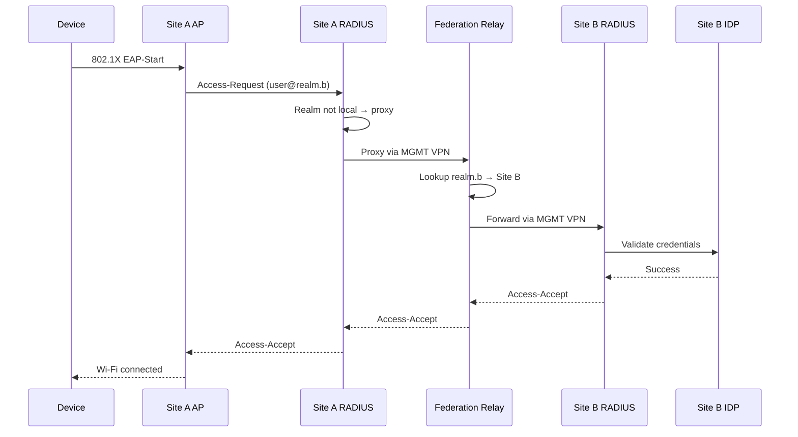

# 认证流程

FadianRoam 使用 **802.1X** 企业级 Wi-Fi 认证与联邦 RADIUS 代理。

## 协议栈

```
┌─────────────────────────────────┐
│        Wi-Fi Supplicant         │  User device (laptop, phone)
├─────────────────────────────────┤
│        EAP-TTLS / PAP          │  Outer: TLS tunnel; Inner: plaintext password
├─────────────────────────────────┤
│        RADIUS (UDP 1812)        │  Authentication protocol
├─────────────────────────────────┤
│        Identity Provider        │  Credential validation
└─────────────────────────────────┘
```

## 认证步骤

### 本地用户（同一站点）

用户在其归属站点连接：



1. 设备发起 802.1X 认证
2. AP 将 EAP 转发至本地 RADIUS 服务器
3. RADIUS 识别 `@realm.a` 为本地域
4. RADIUS 去除域后缀，将凭证发送至 Identity Provider
5. IDP 验证并返回结果
6. RADIUS 发送 Access-Accept 或 Access-Reject

### 漫游用户（不同站点）

来自站点 B 的用户在站点 A 连接：



1. 设备在站点 A 发起 802.1X 认证
2. 站点 A 的 RADIUS 发现 `@realm.b` 不是本地域
3. 站点 A 的 RADIUS 通过 MGMT VPN 将请求代理至 **Federation Relay**
4. Relay 在其域表中查找 `realm.b` 并转发至站点 B 的 RADIUS
5. 站点 B 的 RADIUS 对其自有 IDP 进行验证
6. 结果沿原路返回

## EAP 配置

### 支持的方法

| 方法 | 支持状态 | 说明 |
|--------|---------|-------|
| EAP-TTLS/PAP | **必需** | 主要方法，IDP 集成最简单 |
| PEAP/MSCHAPv2 | 可选 | 需要 IDP 中存储密码哈希 |
| EAP-TLS | 可选 | 基于证书，无需密码 |

### 为什么选择 EAP-TTLS/PAP？

EAP-TTLS 在设备和 RADIUS 服务器之间建立 TLS 隧道。在此隧道内，凭证以明文（PAP）方式发送。这是安全的，因为：

- 外层 TLS 隧道加密了所有无线传输内容
- RADIUS 服务器解密后通过本地连接转发至 IDP
- IDP 收到标准的凭证验证请求
- 无密码哈希方案兼容性问题

### TLS 证书

每个成员的 RADIUS 服务器需要为 EAP 外层隧道提供有效的 TLS 证书：

- 必须由**公共受信任 CA** 签发
- 自签名证书会导致大多数设备连接失败
- 证书 CN/SAN 应匹配成员的 RADIUS 域名
- 强烈建议启用自动续期

## IDP 集成

### 凭证验证

RADIUS 服务器必须能够根据成员的 Identity Provider 验证用户凭证。具体的集成方式（ROPC、LDAP、REST API、本地数据库等）由各成员自行决定。

关键要求是：

- RADIUS 接收用户名和密码（来自内层 EAP 隧道）
- RADIUS 查询 IDP 以验证这些凭证
- IDP 返回成功或失败
- RADIUS 相应发送 Access-Accept 或 Access-Reject

### 身份隔离

每个成员为其漫游用户运营独立的身份系统：

- 成员之间不同步用户
- 每个成员控制自己的用户生命周期（注册、暂停、删除）

## 用户注册

每个 FadianRoam 站点（分支）独立管理其域的用户注册。

### 注册策略

每个站点自行决定注册策略：

| 策略 | 描述 |
|--------|-------------|
| **开放** | 任何人都可以在该站点注册账户 |
| **邀请制** | 注册需要站点运营者的邀请 |
| **封闭** | 不开放公共注册；账户仅由管理员创建 |

联邦不强制统一策略——各站点可自由选择适合其使用场景的方式。

### 用户身份

- 用户在特定站点注册，获得该站点域下的凭证
- 身份格式：`username@site-realm`（例如 `edward.sun@roam.yunzheng.space`）
- 用户凭证可通过漫游在全球**任意** FadianRoam AP 使用
- 归属站点负责认证其自有用户，无论用户在哪里连接

### 漫游权限

在任意 FadianRoam 站点注册的用户均可在其他站点的 AP 上连接。归属站点对其用户的行为和流量承担责任。

## 域命名

每个成员在联邦中注册唯一的域标识符：

- 格式：`roam.example.net` 或 `member-name.fadianroam.net`
- 必须是有效的 DNS 风格标识符
- 在联邦配置仓库中注册
- 用于 RADIUS 域路由（例如 `user@roam.example.net`）

!!! warning "域唯一性"
    域名在联邦内必须全局唯一。Federation Relay 使用域名将认证请求路由至正确的成员。
