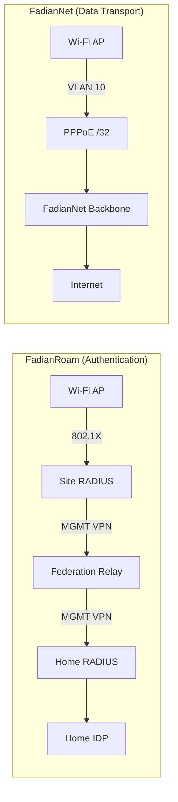
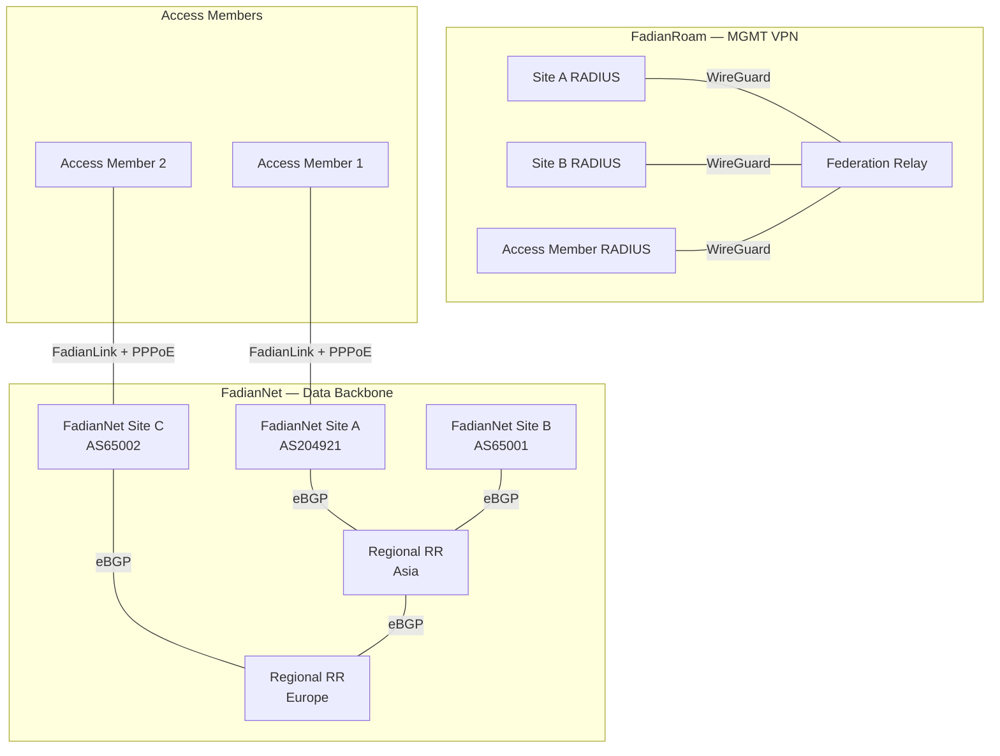

# Network Design

FadianRoam's network is split into two independent planes: **FadianRoam** (authentication) and **FadianNet** (data transport). They serve different purposes but work together to deliver seamless roaming Wi-Fi.

## FadianRoam vs FadianNet



| | FadianRoam | FadianNet |
|---|---|---|
| **Purpose** | 802.1X authentication & roaming | User data transport & internet access |
| **Transport** | MGMT VPN (WireGuard star) | BGP backbone (VPN mesh + eBGP) |
| **Traffic** | RADIUS (UDP 1812/1813) | User internet traffic |
| **Participants** | All Sites | FadianNet Sites (provider) + Access Members (user) |
| **Nature** | FadianRoam project infrastructure | Public-good backbone maintained by BGP Sites |

## Architecture Overview



## FadianRoam Layer: MGMT VPN

Purpose: RADIUS authentication proxy traffic only.

| Property | Value |
|----------|-------|
| Transport | WireGuard (star, no mesh) |
| Subnet | `172.172.10.0/24` |
| Relay IP | `172.172.10.1` |
| Member IPs | Assigned on join (e.g., `172.172.10.10`) |
| Traffic | RADIUS (UDP 1812/1813) only |
| Required | Yes, for all FadianRoam Sites |

Each member establishes a WireGuard tunnel to the Federation Relay. This tunnel is used exclusively for RADIUS proxy traffic. No mesh — all members connect to the central Relay only.

All FadianRoam Sites connect to the MGMT VPN, regardless of whether they also participate in FadianNet.

## FadianNet Layer: Data Backbone

Purpose: Carry user internet traffic after 802.1X authentication.

FadianNet is the data plane — the actual network that carries user traffic to the internet. It is maintained collectively by FadianNet Sites as a **public good**.

### FadianNet Roles

Sites participating in FadianNet fall into two roles:

| Role | Description | Requirements |
|------|-------------|--------------|
| **FadianNet Site** (Provider + User) | Operates BGP, provides network service to others AND uses FadianNet | Own ASN, BGP daemon, public IP, FadianNet VPN |
| **Access Member** (User only) | Connects to FadianNet through a FadianNet Site, uses network but does not provide transit | MGMT VPN + FadianLink to a FadianNet Site |

```
FadianNet Site (Provider + User)
  ├── Has own ASN, peers with Regional RR
  ├── Announces shared prefix to upstream (RPKI)
  ├── Provides transit to Access Members via FadianLink
  └── Runs PPPoE server for Access Members

Access Member (User only)
  ├── Connects MGMT VPN (for RADIUS federation)
  ├── Connects to a FadianNet Site via FadianLink
  ├── Dials PPPoE to get /32, NATs AP users behind it
  └── All traffic routes through upstream FadianNet Site
```

A FadianRoam Site that also provides BGP transit is simultaneously a **FadianRoam Site** (authentication) and a **FadianNet Site** (data). A Site without BGP only joins FadianRoam for authentication and connects to FadianNet as an Access Member for data.

!!! info "LIR / Enduser Analogy"
    FadianNet's role structure is analogous to the RIPE LIR / Enduser model:

    - **FadianNet Provider** ≈ LIR — has its own ASN, operates Regional RR, builds and maintains the backbone
    - **Access Member** ≈ Enduser — joins through a Provider, no ASN or BGP knowledge required

### Topology

FadianNet Sites peer with **Regional Route Reflectors** using their own ASN (eBGP):

```
          RR Asia ←── eBGP ──→ RR Europe
           ▲  ▲                  ▲  ▲
          /    \                /    \
    Site A    Site B      Site C    Site D
   AS204921  AS65001     AS65002   AS65003
       │                     │
       └── Access Member 1   └── Access Member 2
           (via FadianLink)      (via FadianLink)
```

- RRs are **not** iBGP route reflectors — each Site uses its own ASN
- RRs aggregate and redistribute routes across regions
- RRs peer with each other for cross-region reachability

## FadianLink

FadianLink bridges FadianNet Sites and Access Members, allowing Sites without BGP to use the FadianNet data plane.

```
Access Member (no ASN)
    │
    └── VPN ──→ FadianNet Site (AS204921)
                    │
                    ├── PPPoE server assigns /32 to Access Member
                    ├── Announces Access Member's /32 into FadianNet
                    └── Provides default route to Access Member
```

### For FadianNet Sites

- Run a PPPoE server for connected Access Members
- Announce Access Members' /32 routes into FadianNet on their behalf
- Provide default route (internet gateway) to Access Members
- Choose which Access Members to serve

### For Access Members

- Connect VPN to a FadianNet Site offering FadianLink
- Dial PPPoE to get /32, NAT AP users behind it
- All traffic routes through the upstream FadianNet Site
- No ASN, no BGP configuration needed

### Comparison

| | FadianNet Site | Access Member (via FadianLink) |
|---|---|---|
| ASN | Own ASN | None |
| BGP peering | Direct with regional RR | None — FadianNet Site peers on behalf |
| /32 announcement | Self | FadianNet Site announces on behalf |
| /24 upstream | Announces to own upstreams | Not applicable |
| Internet path | Own uplinks | Through FadianNet Site's uplinks |
| RPKI | Signs ROAs | Not applicable |

## VLAN Architecture

Each FadianRoam Site must isolate FadianRoam traffic from local network traffic using VLANs:

```
AP
 ├── SSID: FadianRoam ──→ VLAN 10 ──→ FadianNet (PPPoE /32)
 └── SSID: Local        ──→ VLAN 20 ──→ Local internet uplink
```

| VLAN | SSID | Traffic Path | Purpose |
|------|------|-------------|---------|
| 10 | `FadianRoam` | AP → FadianNet backbone → Internet | Federation roaming traffic, 802.1X authenticated |
| 20 | Site-specific | AP → Local gateway → Internet | Site's own local network, not part of FadianRoam |

### Why VLAN Isolation?

- **Accounting**: FadianRoam traffic is measurable and attributable per Site
- **Fair use enforcement**: Bandwidth limits apply only to VLAN 10
- **Security**: FadianRoam users cannot access the Site's local network
- **Commercial clarity**: If a Site monetizes FadianRoam, only VLAN 10 traffic counts toward billing

### AP Requirements

- AP must support **multiple SSIDs with VLAN tagging**
- The `FadianRoam` SSID must be tagged to a dedicated VLAN
- The FadianRoam VLAN must route exclusively through the FadianNet data plane (PPPoE tunnel)
- Local VLANs must **not** carry FadianRoam traffic

## Data Plane Design — Active Discussion

!!! warning "Design Decision in Progress"
    The FadianNet data plane routing model is currently under evaluation. Two proposals are being considered. Community input is welcome — discuss in the [Telegram group](https://t.me/+WLLU-KOXcQFiMTg1) or open a ticket at [YunZheng HelpCentre](https://helpdesk.yunzheng.space).

### Proposal A: Shared Public Prefix (Anycast Model)

A sponsored **/24 prefix** is announced by all FadianNet Sites, with internal /32 routing for per-site addressing.

```
External (public internet):
  All FadianNet Sites announce X.X.X.0/24 via own ASN
  RPKI ROAs authorize multiple ASes for the same /24
  → External traffic enters via nearest FadianNet Site (anycast)

Internal (FadianNet eBGP):
  Site A (AS204921): X.X.X.1/32 + X.X.X.5/32 (Access Member)
  Site B (AS65001):  X.X.X.2/32 + X.X.X.8/32 (Access Member)
  → /32 routes propagate freely between all FadianNet Sites
```

**How it works**:

1. Each FadianNet Site announces the aggregate /24 to its own upstream providers (RPKI-valid)
2. Each Site/Access Member is assigned a /32 from the shared prefix (via PPPoE)
3. Internally, /32 fine-grained routes propagate via Regional RR eBGP
4. External traffic enters via the nearest announcing FadianNet Site (anycast), then routes internally to the correct /32
5. Users access the internet through the FadianNet backbone — traffic exits at the nearest FadianNet Site

| Property | Value |
|----------|-------|
| Public prefix | Sponsored /24 (TBD) |
| RPKI | Multi-AS ROA — each FadianNet Site's ASN authorized |
| External routing | Anycast /24, nearest-entry |
| Internal routing | /32 per Site, eBGP via Regional RRs |
| IP assignment | /32 from shared prefix, assigned via PPPoE |
| User traffic path | AP → VLAN 10 → PPPoE /32 → FadianNet → nearest exit → Internet |

**Pros**:

- Unified public address space — all FadianRoam users share one routable /24
- Anycast entry — external traffic enters at the geographically closest FadianNet Site
- Clean separation — FadianRoam traffic is identifiable by prefix
- Access Members don't need their own IP resources
- Scalable — supports many Sites with /32 allocation

**Cons**:

- Requires a sponsored /24 prefix
- RPKI multi-AS ROA management adds operational complexity
- Dependency on the prefix sponsor

---

### Proposal B: Internal Loopback + Home Routing

FadianNet uses an **internal /24** for loopback addressing (similar to OSPF/IGP), and roaming users' traffic is tunneled back to their home Site for internet access.

```
Internal (FadianNet):
  Site A loopback: 172.172.11.1
  Site B loopback: 172.172.11.2
  Access Member loopback: 172.172.11.5
  → Internal reachability via eBGP loopback routes

User traffic flow:
  User@Site_B connects at Site_A AP
  → Traffic tunneled back to Site_B (home) → Site_B uplink → Internet
```

**How it works**:

1. FadianNet Sites peer via eBGP with internal loopback addressing (/24)
2. When a user roams, their traffic is tunneled back to their home Site
3. The home Site provides internet access via its own uplinks
4. No shared public prefix needed — each Site uses its own IP resources

| Property | Value |
|----------|-------|
| Public prefix | None (each Site uses own) |
| Internal routing | Loopback /24, eBGP between FadianNet Sites |
| User traffic path | AP → tunnel back to home Site → home uplink → Internet |

**Pros**:

- No dependency on a sponsored prefix
- Each Site uses its own IP resources and uplinks
- Simpler RPKI — no multi-AS ROA coordination

**Cons**:

- **Uneven link cost**: Roaming traffic must traverse back to the home Site, potentially crossing multiple hops. A user in Europe connected at an Asia Site would have their traffic routed all the way back to Europe before reaching the internet.
- **Forced BGP binding**: Access Members without BGP are dependent on a FadianNet Site for both transit AND home-routing, creating a tight coupling.
- **Higher latency for roaming users**: Traffic always exits at the home Site, not the nearest exit.

---

### Comparison

| Aspect | Proposal A (Shared Prefix) | Proposal B (Home Routing) |
|--------|---------------------------|--------------------------|
| Public IP resources | Sponsored /24 shared | Each Site's own |
| External traffic entry | Nearest FadianNet Site (anycast) | Home Site only |
| Roaming latency | Low (nearest exit) | High (tunnel to home) |
| RPKI complexity | Multi-AS ROA | Per-site ROA |
| Access Member dependency | PPPoE /32 from backbone | Tunnel back to sponsor |
| Prefix sponsor required | Yes | No |
| Scalability | High | Limited by home-routing overhead |

!!! note "Current Leaning"
    Proposal A (Shared Public Prefix) is the preferred direction. It provides better user experience through anycast routing, cleaner traffic accounting, and lower roaming latency. The main prerequisite is securing a sponsored /24 prefix.

    Discussion is ongoing — join the conversation in the [Telegram group](https://t.me/+WLLU-KOXcQFiMTg1).

!!! quote "Community Discussion"
    **Jack (AS153376)** raised the question: if an ORG has a large number of users across multiple locations connecting to FadianRoam nodes (e.g., JianyuelabLTD), should the Site be classified as commercial use rather than hobby use?

    **Response**: For commercial scenarios, the Governance Committee should establish a usage standard on FadianRoam using a **quota** system. When usage exceeds the hobby-use quota, the additional network costs are shared equally among all BGP Sites at a fixed per-quota rate. Each ORG bears the cost of its own usage beyond the hobby-use baseline — specifically, the incremental cost that BGP Sites incur on its behalf.

## Internal Addressing

| Network | Subnet | Purpose |
|---------|--------|---------|
| MGMT | `172.172.10.0/24` | RADIUS relay tunnels (FadianRoam) |
| FadianNet Loopbacks | `172.172.11.0/24` | Router IDs for FadianNet Sites |
| FadianNet P2P | `172.172.12.0/24` | VPN point-to-point links |
| FadianRoam Prefix | `TBD /24` | PPPoE-assigned member IPs (Proposal A) |
| FadianRoam v6 | `TBD` | IPv6 allocation |

## IPv6-Only Sites: 464XLAT

Sites without public IPv4 can participate in FadianNet using **464XLAT** (RFC 6877). This allows an IPv6-only site to provide full IPv4 connectivity to user devices:

```
User device (IPv4 app)
    → CLAT (client-side translation, on AP/gateway)
    → IPv6-only FadianNet transport
    → PLAT (provider-side translation, at FadianNet Site)
    → IPv4 internet
```

This lowers the barrier for Access Members that only have IPv6 connectivity — no public IPv4 allocation required.

## Traffic Flow

End-to-end flow for a roaming user at an Access Member site:

```
1. User connects to FadianRoam SSID → 802.1X authentication
2. AP → Site RADIUS → MGMT VPN → Federation Relay → Home RADIUS → IDP
3. Access-Accept → User gets Wi-Fi on VLAN 10
4. User traffic → VLAN 10 → PPPoE /32 → FadianLink VPN → FadianNet Site → Internet
```

## Member Types & Requirements

| Requirement | FadianNet Site (Provider + User) | Access Member (User only) |
|-------------|----------------------------------|---------------------------|
| MGMT VPN to Relay | Required | Required |
| FadianNet VPN | Direct to regional RR | Via FadianLink to FadianNet Site |
| PPPoE dial-up | Required | Required |
| Own ASN | Required | Not required |
| eBGP session | Required | Not required |
| RPKI (ROA) | Required | Not required |
| /24 upstream announcement | Required | Not required |
| Wi-Fi AP with 802.1X | Required | Required |
| Public IP | Recommended | Not required |
