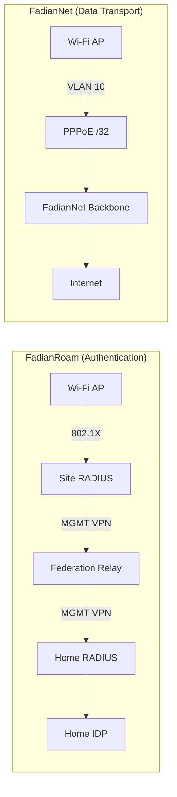
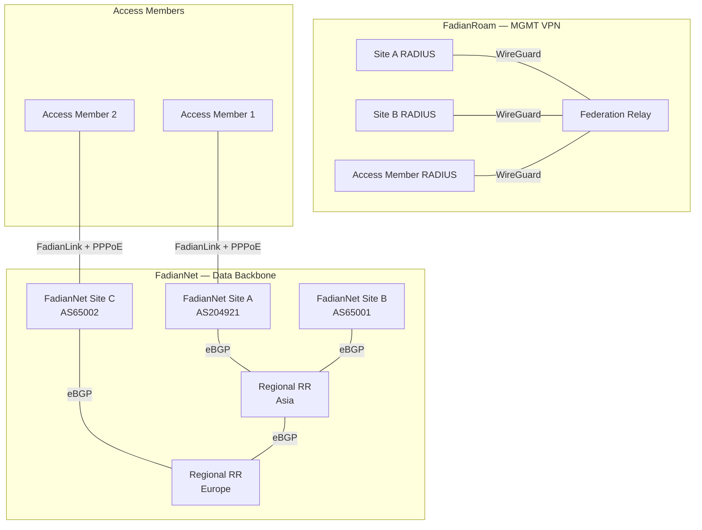
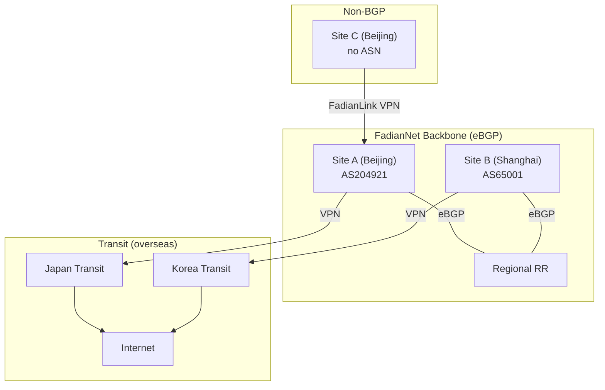

# Network Design

FadianRoam's network is split into two independent planes: **FadianRoam** (authentication) and **FadianNet** (data transport). They serve different purposes but work together to deliver seamless roaming Wi-Fi.

## FadianRoam vs FadianNet



| | FadianRoam | FadianNet |
|---|---|---|
| **Purpose** | 802.1X authentication & roaming | User data transport & internet access |
| **Transport** | MGMT VPN (WireGuard star) | BGP backbone (VPN mesh + eBGP) |
| **Traffic** | RADIUS (UDP 1812/1813) | User internet traffic |
| **Participants** | All Sites | FadianNet Sites (provider) + Access Members (user) |
| **Nature** | FadianRoam project infrastructure | Public-good backbone maintained by BGP Sites |

## Architecture Overview



## FadianRoam Layer: MGMT VPN

Purpose: RADIUS authentication proxy traffic only.

| Property | Value |
|----------|-------|
| Transport | WireGuard (star, no mesh) |
| Subnet | `172.172.10.0/24` |
| Relay IP | `172.172.10.1` |
| Member IPs | Assigned on join (e.g., `172.172.10.10`) |
| Traffic | RADIUS (UDP 1812/1813) only |
| Required | Yes, for all FadianRoam Sites |

Each member establishes a WireGuard tunnel to the Federation Relay. This tunnel is used exclusively for RADIUS proxy traffic. No mesh — all members connect to the central Relay only.

All FadianRoam Sites connect to the MGMT VPN, regardless of whether they also participate in FadianNet.

## FadianNet Layer: Data Backbone

Purpose: Carry user internet traffic after 802.1X authentication.

FadianNet is the data plane — the actual network that carries user traffic to the internet. It is maintained collectively by FadianNet Sites as a **public good**.

### FadianNet Roles

Sites participating in FadianNet fall into two roles:

| Role | Description | Requirements |
|------|-------------|--------------|
| **FadianNet Site** (Provider + User) | Operates BGP, provides network service to others AND uses FadianNet | Own ASN, BGP daemon, public IP, FadianNet VPN |
| **Access Member** (User only) | Connects to FadianNet through a FadianNet Site, uses network but does not provide transit | MGMT VPN + FadianLink to a FadianNet Site |

```
FadianNet Site (Provider + User)
  ├── Has own ASN, peers with Regional RR
  ├── Announces shared prefix to upstream (RPKI)
  ├── Provides transit to Access Members via FadianLink
  └── Runs PPPoE server for Access Members

Access Member (User only)
  ├── Connects MGMT VPN (for RADIUS federation)
  ├── Connects to a FadianNet Site via FadianLink
  ├── Dials PPPoE to get /32, NATs AP users behind it
  └── All traffic routes through upstream FadianNet Site
```

A FadianRoam Site that also provides BGP transit is simultaneously a **FadianRoam Site** (authentication) and a **FadianNet Site** (data). A Site without BGP only joins FadianRoam for authentication and connects to FadianNet as an Access Member for data.

!!! info "Analogy: Similar to RIPE LIR / Enduser"
    This structure is analogous to the RIPE NCC's LIR / Enduser model — a FadianNet Site acts like an LIR (operates infrastructure, sponsors downstream members), while a non-BGP Site seeking FadianRoam access acts like an Enduser (joins through a local LIR). The analogy describes the relationship, not the actual naming.

### Non-BGP Site Admission

A Site without BGP cannot join FadianNet directly. To participate in FadianRoam, it must:

1. Find the **nearest FadianNet + FadianRoam Site** in its region (the "sponsor")
2. The sponsor agrees to provide FadianLink connectivity
3. The **sponsor submits the application PR** on behalf of the non-BGP Site to the federation
4. Federation votes (>50%, 3 days) — the sponsor vouches for the applicant
5. On approval, the non-BGP Site connects via FadianLink to the sponsor and deploys FadianRoam APs

The sponsor's BGP site becomes the non-BGP site's internet exit point — all roaming traffic from the non-BGP site routes back to the sponsor.

### Topology

FadianNet Sites peer with **Regional Route Reflectors** using their own ASN (eBGP):

```
          RR Asia ←── eBGP ──→ RR Europe
           ▲  ▲                  ▲  ▲
          /    \                /    \
    Site A    Site B      Site C    Site D
   AS204921  AS65001     AS65002   AS65003
       │                     │
       └── Access Member 1   └── Access Member 2
           (via FadianLink)      (via FadianLink)
```

- RRs are **not** iBGP route reflectors — each Site uses its own ASN
- RRs aggregate and redistribute routes across regions
- RRs peer with each other for cross-region reachability

## FadianLink

FadianLink bridges FadianNet Sites and Access Members, allowing Sites without BGP to use the FadianNet data plane.

```
Access Member (no ASN)
    │
    └── VPN ──→ FadianNet Site (AS204921)
                    │
                    ├── PPPoE server assigns /32 to Access Member
                    ├── Announces Access Member's /32 into FadianNet
                    └── Provides default route to Access Member
```

### For FadianNet Sites

- Run a PPPoE server for connected Access Members
- Announce Access Members' /32 routes into FadianNet on their behalf
- Provide default route (internet gateway) to Access Members
- Choose which Access Members to serve

### For Access Members

- Connect VPN to a FadianNet Site offering FadianLink
- Dial PPPoE to get /32, NAT AP users behind it
- All traffic routes through the upstream FadianNet Site
- No ASN, no BGP configuration needed

### Comparison

| | FadianNet Site | Access Member (via FadianLink) |
|---|---|---|
| ASN | Own ASN | None |
| BGP peering | Direct with regional RR | None — FadianNet Site peers on behalf |
| /32 announcement | Self | FadianNet Site announces on behalf |
| /24 upstream | Announces to own upstreams | Not applicable |
| Internet path | Own uplinks | Through FadianNet Site's uplinks |
| RPKI | Signs ROAs | Not applicable |

## VLAN Architecture

Each FadianRoam Site must isolate FadianRoam traffic from local network traffic using VLANs:

```
AP
 ├── SSID: FadianRoam ──→ VLAN 10 ──→ FadianNet (PPPoE /32)
 └── SSID: Local        ──→ VLAN 20 ──→ Local internet uplink
```

| VLAN | SSID | Traffic Path | Purpose |
|------|------|-------------|---------|
| 10 | `FadianRoam` | AP → FadianNet backbone → Internet | Federation roaming traffic, 802.1X authenticated |
| 20 | Site-specific | AP → Local gateway → Internet | Site's own local network, not part of FadianRoam |

### Why VLAN Isolation?

- **Accounting**: FadianRoam traffic is measurable and attributable per Site
- **Fair use enforcement**: Bandwidth limits apply only to VLAN 10
- **Security**: FadianRoam users cannot access the Site's local network
- **Commercial clarity**: If a Site monetizes FadianRoam, only VLAN 10 traffic counts toward billing

### AP Requirements

- AP must support **multiple SSIDs with VLAN tagging**
- The `FadianRoam` SSID must be tagged to a dedicated VLAN
- The FadianRoam VLAN must route exclusively through the FadianNet data plane (PPPoE tunnel)
- Local VLANs must **not** carry FadianRoam traffic

## Data Plane Design — Active Discussion

!!! warning "Design Decision in Progress"
    The FadianNet data plane routing model is currently under evaluation. Two proposals are being considered. Community input is welcome — discuss in the [Telegram group](https://t.me/+WLLU-KOXcQFiMTg1) or open a ticket at [YunZheng HelpCentre](https://helpdesk.yunzheng.space).

### Proposal A: Shared Public Prefix (Anycast Model)

A sponsored **/24 prefix** is announced by all FadianNet Sites, with internal /32 routing for per-site addressing.

```
External (public internet):
  All FadianNet Sites announce X.X.X.0/24 via own ASN
  RPKI ROAs authorize multiple ASes for the same /24
  → External traffic enters via nearest FadianNet Site (anycast)

Internal (FadianNet eBGP):
  Site A (AS204921): X.X.X.1/32 + X.X.X.5/32 (Access Member)
  Site B (AS65001):  X.X.X.2/32 + X.X.X.8/32 (Access Member)
  → /32 routes propagate freely between all FadianNet Sites
```

**How it works**:

1. Each FadianNet Site announces the aggregate /24 to its own upstream providers (RPKI-valid)
2. Each Site/Access Member is assigned a /32 from the shared prefix (via PPPoE)
3. Internally, /32 fine-grained routes propagate via Regional RR eBGP
4. External traffic enters via the nearest announcing FadianNet Site (anycast), then routes internally to the correct /32
5. Users access the internet through the FadianNet backbone — traffic exits at the nearest FadianNet Site

| Property | Value |
|----------|-------|
| Public prefix | Sponsored /24 (TBD) |
| RPKI | Multi-AS ROA — each FadianNet Site's ASN authorized |
| External routing | Anycast /24, nearest-entry |
| Internal routing | /32 per Site, eBGP via Regional RRs |
| IP assignment | /32 from shared prefix, assigned via PPPoE |
| User traffic path | AP → VLAN 10 → PPPoE /32 → FadianNet → nearest exit → Internet |

**Pros**:

- Unified public address space — all FadianRoam users share one routable /24
- Anycast entry — external traffic enters at the geographically closest FadianNet Site
- Clean separation — FadianRoam traffic is identifiable by prefix
- Access Members don't need their own IP resources
- Scalable — supports many Sites with /32 allocation

**Cons**:

- Requires a sponsored /24 prefix
- RPKI multi-AS ROA management adds operational complexity
- Dependency on the prefix sponsor

---

### Proposal B: Internal Loopback + Home Routing (BGP Backbone)

FadianNet uses an **internal /24** for loopback addressing (similar to OSPF/IGP). All FadianNet Sites **must have BGP** — this is mandatory for the backbone to function. Roaming users' traffic is tunneled back to their home Site for internet access.

```
FadianNet Backbone (eBGP mesh via Regional RRs)
│
├── FadianNet Site A (AS204921) ← loopback 172.172.11.1, own internet exit
│   ├── FadianRoam AP (own users → exit at Site A)
│   └── Non-BGP Site X (FadianRoam AP → roams back to Site A for exit)
│
├── FadianNet Site B (AS65001) ← loopback 172.172.11.2, own internet exit
│   ├── FadianRoam AP (own users → exit at Site B)
│   └── Non-BGP Site Y (FadianRoam AP → roams back to Site B for exit)
│
└── FadianNet Site C (AS65002) ← loopback 172.172.11.3, own internet exit
    └── FadianRoam AP (own users → exit at Site C)
```

**How it works**:

1. All FadianNet Sites peer via eBGP (each with own ASN), forming a virtual BGP backbone
2. Each Site has a loopback IP from the internal prefix; /32 loopback routes propagate via eBGP through Regional RRs
3. When a user roams to a visited Site, their traffic is routed back through the backbone to their **home Site** (the FadianNet Site that provides their FadianRoam access)
4. The home Site provides internet access via its own uplinks
5. Non-BGP Sites connect through a sponsoring FadianNet Site via FadianLink; their users' traffic routes back to the sponsor's exit

**Roaming scenarios**:

```
Scenario 1: BGP Site user roaming
  User registered at Site A → connects at Site C AP
  → Auth via MGMT VPN (FadianRoam)
  → Data: Site C → FadianNet backbone → Site A (home) → Internet

Scenario 2: Non-BGP Site user roaming
  User registered at Non-BGP Site X (sponsor: Site A) → connects at Site B AP
  → Auth via MGMT VPN (FadianRoam)
  → Data: Site B → FadianNet backbone → Site A (sponsor) → Internet
```

#### Real-World Example

Consider a scenario where all sites use overseas transit (e.g., in regions where domestic IP Transit is unavailable):

```
Site A (Beijing, own AS)
  └── VPN → Japan Transit → Internet
  └── FadianRoam AP at home in Beijing

Site B (Shanghai, own AS)
  └── VPN → Korea Transit → Internet
  └── FadianRoam AP at home in Shanghai

Site C (Beijing, no BGP)
  └── Sponsored by Site A
  └── VPN → Site A Beijing PoP → A's FadianNet → Internet
  └── FadianRoam AP at home in Beijing
```



**Normal operation (no roaming)**:

- Site A users connect at A's AP → traffic exits via A's Japan transit
- Site B users connect at B's AP → traffic exits via B's Korea transit
- Site C users connect at C's AP → traffic routes through A's FadianNet → exits via A's Japan transit
- Within FadianNet, A and B may exchange routes via eBGP — A can choose to route some traffic through B's Korea transit (or vice versa) based on BGP path selection

**User from A roams to B's house (Shanghai)**:

1. A's user connects to B's FadianRoam AP
2. Auth: B's RADIUS → MGMT VPN → Federation Relay → A's RADIUS → A's IDP → Access-Accept
3. Data: B's AP → FadianNet backbone → roams back to **A's Beijing site** → A's Japan transit → Internet
4. Some routes may still be selected through B's Korea exit based on BGP path selection — this detour is acceptable and can be fine-tuned with route policy if needed

**User from C roams to B's house (Shanghai)**:

1. C's user connects to B's FadianRoam AP
2. Auth: B's RADIUS → MGMT VPN → Federation Relay → **C's RADIUS** → C's IDP → Access-Accept (C has its own MGMT VPN to Federation Relay)
3. Data: B's AP → FadianNet backbone → roams back to **A's Beijing site** (C's sponsor) → A's Japan transit → Internet

!!! info "Authentication vs Data Path"
    Authentication always routes to the **user's own FadianRoam Site** (each Site has its own MGMT VPN to the Federation Relay). Data always routes to the user's **home FadianNet Site** (the BGP site providing their internet exit). For non-BGP Sites, these are different: auth goes to C, data goes to A (C's sponsor).

!!! note "Routing Detours"
    In default FadianNet routing, some paths may be suboptimal — e.g., traffic from B roaming back to A might still be selected to exit through B's Korea transit based on BGP best path. This is normal BGP behavior and acceptable for a community network. Sites can coordinate to adjust route policy for specific cases, but some detour is inherent to the home-routing model.

| Property | Value |
|----------|-------|
| Public prefix | None (each Site uses own) |
| Internal routing | Loopback /24, eBGP between FadianNet Sites |
| BGP requirement | **Mandatory** for all FadianNet Sites |
| User traffic path | AP → FadianNet backbone → home Site → home uplink → Internet |
| Non-BGP Site path | AP → FadianNet backbone → sponsor Site → sponsor uplink → Internet |

**Pros**:

- No dependency on a sponsored prefix — each Site uses its own IP resources
- Simpler RPKI — no multi-AS ROA coordination
- Mandatory BGP ensures backbone quality — every participant contributes routing
- Clear sponsorship model for non-BGP Sites
- Traffic accounting is straightforward — each Site's exit traffic is measurable

**Cons**:

- **Higher roaming latency**: Traffic always exits at the home Site, not the nearest exit. A user in Asia connected at a Europe Site would have traffic routed back to Asia.
- **Cross-region bandwidth cost**: Long-distance roaming consumes backbone bandwidth between regions.
- **Sponsor dependency**: Non-BGP Sites are fully dependent on their sponsor for internet exit.

---

### Comparison

| Aspect | Proposal A (Shared Prefix) | Proposal B (Home Routing) |
|--------|---------------------------|--------------------------|
| Public IP resources | Sponsored /24 shared | Each Site's own |
| External traffic entry | Nearest FadianNet Site (anycast) | Home Site only |
| Roaming latency | Low (nearest exit) | High (tunnel to home) |
| RPKI complexity | Multi-AS ROA | Per-site ROA |
| Access Member dependency | PPPoE /32 from backbone | Tunnel back to sponsor |
| Prefix sponsor required | Yes | No |
| Scalability | High | Limited by home-routing overhead |

!!! note "Current Leaning"
    Proposal B (Internal Loopback + Home Routing) is the current preferred direction. It enforces mandatory BGP for all backbone participants, provides a clear sponsorship model for non-BGP Sites, and avoids dependency on a sponsored prefix. The tradeoff is higher roaming latency, which is acceptable for a community network.

    Both proposals remain under consideration — join the discussion in the [Telegram group](https://t.me/+WLLU-KOXcQFiMTg1).

!!! quote "Community Discussion"
    **Jack (AS153376)** raised the question: if an ORG has a large number of users across multiple locations connecting to FadianRoam nodes (e.g., JianyuelabLTD), should the Site be classified as commercial use rather than hobby use?

    **Response**: For commercial scenarios, the Governance Committee should establish a usage standard on FadianRoam using a **quota** system. When usage exceeds the hobby-use quota, the additional network costs are shared equally among all BGP Sites at a fixed per-quota rate. Each ORG bears the cost of its own usage beyond the hobby-use baseline — specifically, the incremental cost that BGP Sites incur on its behalf.

## Internal Addressing

| Network | Subnet | Purpose |
|---------|--------|---------|
| MGMT | `172.172.10.0/24` | RADIUS relay tunnels (FadianRoam) |
| FadianNet Loopbacks | `172.172.11.0/24` | Router IDs for FadianNet Sites |
| FadianNet P2P | `172.172.12.0/24` | VPN point-to-point links |
| FadianRoam Prefix | `TBD /24` | PPPoE-assigned member IPs (Proposal A) |
| FadianRoam v6 | `TBD` | IPv6 allocation |

## IPv6-Only Sites: 464XLAT

Sites without public IPv4 can participate in FadianNet using **[464XLAT](https://soha.moe/post/ipv6-only-preferred-at-home.html)** (RFC 6877). This allows an IPv6-only site to provide full IPv4 connectivity to user devices:

```
User device (IPv4 app)
    → CLAT (client-side translation, on AP/gateway)
    → IPv6-only FadianNet transport
    → PLAT (provider-side translation, at FadianNet Site)
    → IPv4 internet
```

This lowers the barrier for Access Members that only have IPv6 connectivity — no public IPv4 allocation required.

## Traffic Flow

End-to-end flow for a roaming user at an Access Member site:

```
1. User connects to FadianRoam SSID → 802.1X authentication
2. AP → Site RADIUS → MGMT VPN → Federation Relay → Home RADIUS → IDP
3. Access-Accept → User gets Wi-Fi on VLAN 10
4. User traffic → VLAN 10 → PPPoE /32 → FadianLink VPN → FadianNet Site → Internet
```

## Member Types & Requirements

| Requirement | FadianNet Site (Provider + User) | Access Member (User only) |
|-------------|----------------------------------|---------------------------|
| MGMT VPN to Relay | Required | Required |
| FadianNet VPN | Direct to regional RR | Via FadianLink to FadianNet Site |
| PPPoE dial-up | Required | Required |
| Own ASN | Required | Not required |
| eBGP session | Required | Not required |
| RPKI (ROA) | Required | Not required |
| /24 upstream announcement | Required | Not required |
| Wi-Fi AP with 802.1X | Required | Required |
| Public IP | Recommended | Not required |
