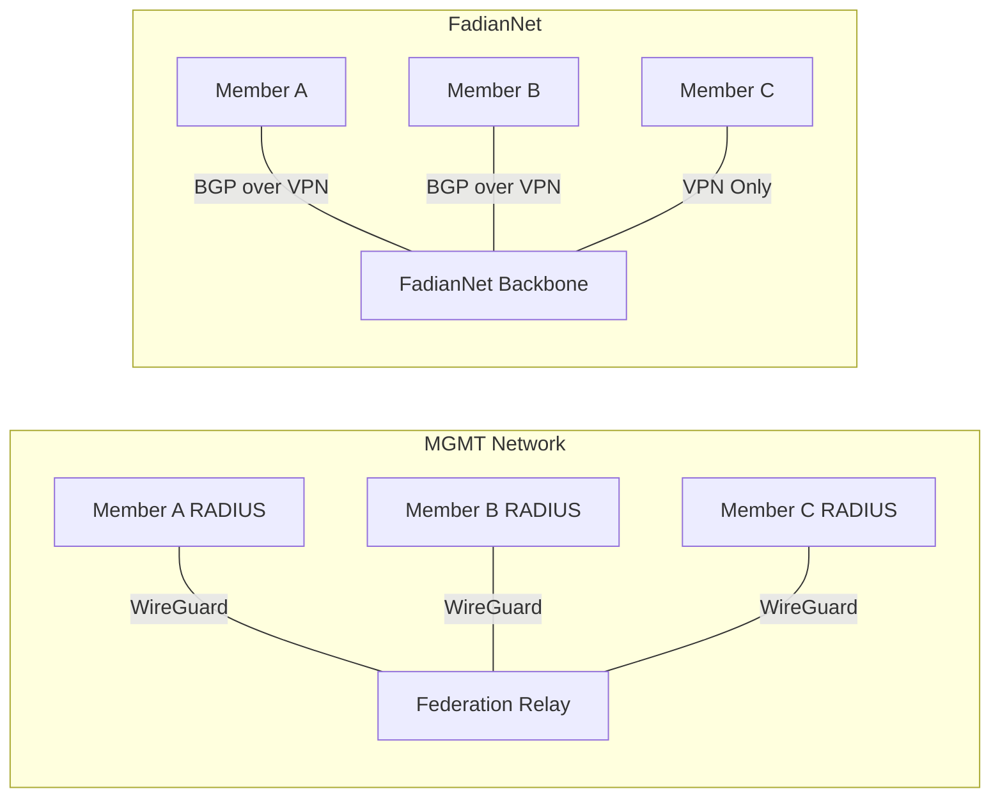

# Network Design

FadianRoam uses two separate networks for isolation between control plane and data plane.

## Two-Network Architecture

### MGMT Network

Purpose: RADIUS authentication traffic only.

| Property | Value |
|----------|-------|
| Transport | WireGuard |
| Subnet | `10.250.0.0/24` |
| Relay IP | `10.250.0.1` |
| Member IPs | Assigned on join (e.g., `10.250.0.10`) |
| Traffic | RADIUS (UDP 1812/1813) only |
| Required | Yes, for all members |

Each member establishes a WireGuard tunnel to the Federation Relay. This tunnel is used exclusively for RADIUS proxy traffic. The Relay uses internal IPs to reach each member's RADIUS server.

### FadianNet (Data Network)

Purpose: Carry actual user internet traffic after authentication.

FadianNet is a shared backbone network. After a roaming user authenticates, their traffic is routed through FadianNet to reach the internet.

#### BGP Members

Members who operate an ASN can participate in FadianNet BGP:

- Peer with FadianNet via **BGP over VPN** (WireGuard / GRE)
- Announce their own prefixes to FadianNet
- Receive FadianNet routes + optional transit
- Contribute to the shared internet backbone
- Can act as **Transit** provider or **Downstream** peer

#### VPN-Only Members

Members without BGP capabilities:

- Connect to FadianNet via **WireGuard VPN**
- Receive a default route from the nearest BGP member
- All roaming user traffic is tunneled through the VPN

## Internal Addressing

| Network | Subnet | Purpose |
|---------|--------|---------|
| MGMT | `10.250.0.0/24` | RADIUS relay tunnels |
| FadianNet Loopbacks | `10.251.0.0/24` | BGP router IDs / loopbacks |
| FadianNet P2P Links | `10.252.0.0/16` | Point-to-point tunnel links |

!!! note "Route Separation"
    MGMT routes and FadianNet routes are kept strictly separate. The MGMT subnet is announced as a single internal route within FadianNet BGP for reachability, but no FadianNet business traffic flows over MGMT tunnels.

## Member Connectivity Requirements

| Requirement | BGP Member | VPN-Only Member |
|-------------|------------|-----------------|
| MGMT VPN to Relay | Required | Required |
| FadianNet VPN | Required | Required |
| BGP session | Required | Not required |
| Own ASN | Required | Not required |
| Public IP | Recommended | Not required |
| Wi-Fi AP with 802.1X | Required | Required |
