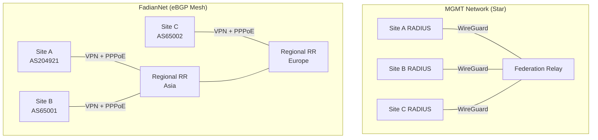

# Network Design

FadianRoam uses three separate network planes: **MGMT**, **FadianNet**, and **PPPoE Access**.

## Architecture



## MGMT Network

Purpose: RADIUS authentication proxy traffic only.

| Property | Value |
|----------|-------|
| Transport | WireGuard (star, no mesh) |
| Subnet | `172.172.10.0/24` |
| Relay IP | `172.172.10.1` |
| Member IPs | Assigned on join (e.g., `172.172.10.10`) |
| Traffic | RADIUS (UDP 1812/1813) only |
| Required | Yes, for all members |

Each member establishes a WireGuard tunnel to the Federation Relay. This tunnel is used exclusively for RADIUS proxy traffic. No mesh — all members connect to the central Relay only.

## FadianNet (Data Network)

Purpose: Carry actual user internet traffic after authentication.

### VPN Layer

Each Site connects to FadianNet via a WireGuard VPN tunnel. The VPN provides Layer 2/3 connectivity but **does not grant network access** by itself.

### PPPoE Access Control

After the VPN link is up, the Site must **PPPoE dial-up** to obtain an IP and start forwarding traffic:

```
Site ──── VPN tunnel ────→ FadianNet node
                │
                └── PPPoE dial-up ──→ Assigned X.X.X.N/32
                                       │
                                       └── Site NATs all AP users behind this IP
```

| Property | Value |
|----------|-------|
| Protocol | PPPoE over VPN |
| IP Assignment | /32 from shared FadianRoam prefix |
| NAT | Site NATs all user devices behind the /32 |
| Authentication | Decentralized PPPoE servers, shared member list |
| Purpose | Business-layer access control |

PPPoE servers are **decentralized** — regional nodes each run a PPPoE server, sharing a common credential list. A Site dials into its nearest regional node.

!!! info "Why PPPoE?"
    VPN connected ≠ authorized to use FadianNet. PPPoE adds a business-layer gate: Sites must actively dial up to provide service. This enables dynamic access control, accounting, and the ability to suspend a Site without touching VPN configuration.

### BGP Routing

Each member participates in FadianNet BGP using their **own ASN**:

#### Internal Routing (/32)

- Each Site announces its PPPoE-assigned **/32** via eBGP
- No prefix-length filtering within FadianNet — all /32s propagate freely
- **Regional Route Reflectors** aggregate routes from nearby Sites
- Full /32 reachability enables direct Site-to-Site traffic

```
Site A (AS204921): announces X.X.X.1/32
Site B (AS65001):  announces X.X.X.2/32
Site C (AS65002):  announces X.X.X.3/32
```

#### External Routing (/24)

- Regional RRs and transit-capable members announce the **aggregate /24** to the public internet
- External traffic reaches the nearest announcing member (anycast-style)
- Individual /32s are **not** announced externally

```
Public internet sees: X.X.X.0/24
  → reaches nearest FadianRoam member
  → internal /32 routing delivers to correct Site
```

#### Regional Route Reflectors

As membership grows, full-mesh eBGP is not scalable. Regional RR nodes serve as route concentration points:

- Each region has one or more RR nodes
- Sites peer with their regional RR (not with every other Site)
- RRs peer with each other to exchange cross-region /32 routes
- RRs are **not** iBGP route reflectors — each member uses their own ASN, forming a confederation-like topology

```
          RR Asia ←── eBGP ──→ RR Europe
           ▲  ▲                  ▲  ▲
          /    \                /    \
    Site A    Site B      Site C    Site D
   AS204921  AS65001     AS65002   AS65003
```

## Shared Prefix

FadianRoam operates a shared IP prefix (placeholder: `X.X.X.0/24`) sponsored by the federation:

| Property | Value |
|----------|-------|
| Prefix | `TBD /24` |
| Allocation | One /32 per active Site |
| Assignment | Via PPPoE on dial-up |
| Internal announcement | /32 per Site (eBGP) |
| External announcement | /24 aggregate (eBGP) |

## Internal Addressing

| Network | Subnet | Purpose |
|---------|--------|---------|
| MGMT | `172.172.10.0/24` | RADIUS relay tunnels |
| FadianNet P2P Links | `172.172.12.0/24` | VPN point-to-point tunnel links |
| FadianRoam Prefix | `TBD /24` | PPPoE-assigned Site IPs |

## Traffic Flow

End-to-end flow for a roaming user:

```
1. User connects to AP at Site A
2. 802.1X → Site A RADIUS → MGMT VPN → Federation Relay → Site B RADIUS → Keycloak
3. Access-Accept → User gets Wi-Fi access
4. User traffic → AP → NAT (X.X.X.N) → FadianNet → Internet
```

## Member Types

### BGP Member

Operates their own ASN and participates in FadianNet eBGP routing. Contributes to the backbone by announcing /32 routes and optionally providing transit.

### Access Member

Does not have an ASN. Connects to MGMT VPN + FadianNet backbone, receives a /32 via PPPoE, and gets a default route from the nearest BGP member or regional RR. Traffic is tunneled through the backbone without the member participating in BGP.

## Member Connectivity Requirements

| Requirement | BGP Member | Access Member |
|-------------|------------|---------------|
| MGMT VPN to Relay | Required | Required |
| FadianNet VPN | Required | Required |
| PPPoE dial-up | Required | Required |
| Own ASN | Required | Not required |
| eBGP session | Required | Not required |
| Wi-Fi AP with 802.1X | Required | Required |
| Public IP | Recommended | Not required |
