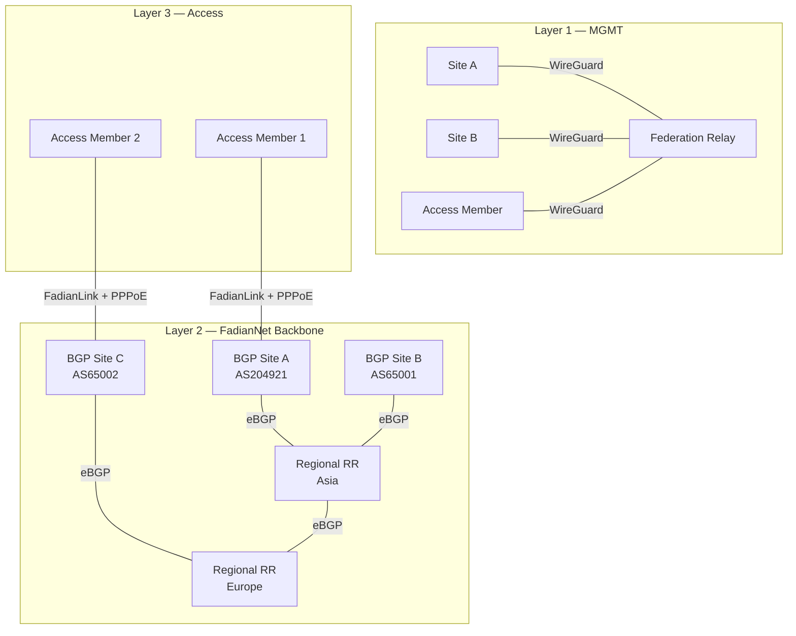

# Network Design

FadianRoam operates three network layers plus a virtual peering service (FadianLink).

## Architecture



## Layer 1: MGMT Network

Purpose: RADIUS authentication proxy traffic only.

| Property | Value |
|----------|-------|
| Transport | WireGuard (star, no mesh) |
| Subnet | `172.172.10.0/24` |
| Relay IP | `172.172.10.1` |
| Member IPs | Assigned on join (e.g., `172.172.10.10`) |
| Traffic | RADIUS (UDP 1812/1813) only |
| Required | Yes, for all members (BGP Sites + Access Members) |

Each member establishes a WireGuard tunnel to the Federation Relay. This tunnel is used exclusively for RADIUS proxy traffic. No mesh — all members connect to the central Relay only.

## Layer 2: FadianNet (BGP Backbone)

Purpose: Data backbone carrying user internet traffic between BGP Sites.

### Participants

Only **BGP Sites** (members with their own ASN) participate directly in FadianNet BGP. Access Members reach FadianNet indirectly through FadianLink.

### Topology

BGP Sites peer with **Regional Route Reflectors** using their own ASN (eBGP):

```
          RR Asia ←── eBGP ──→ RR Europe
           ▲  ▲                  ▲  ▲
          /    \                /    \
    Site A    Site B      Site C    Site D
   AS204921  AS65001     AS65002   AS65003
```

- RRs are **not** iBGP route reflectors — each Site uses its own ASN
- RRs aggregate and redistribute /32 routes across regions
- RRs peer with each other for cross-region reachability

### Shared Prefix

FadianRoam operates a sponsored address space:

| Property | Value |
|----------|-------|
| IPv4 | `TBD /24` (sponsored) |
| IPv6 | `TBD` |
| RPKI | **Mandatory** — all BGP Sites must carry valid ROAs |
| Allocation | /32 per active Site (assigned via PPPoE) |

### External Routing (/24)

- Every BGP Site announces the **aggregate /24** to its own upstream providers
- All announcements must be **RPKI-valid** (ROA signed)
- External traffic reaches the nearest announcing BGP Site (anycast)

### Internal Routing (/32)

- Within FadianNet, **/32 fine-grained routes** propagate freely
- No prefix-length filtering — all /32s are accepted between BGP Sites
- Each /32 represents one active member (BGP Site or Access Member)
- BGP Sites announce their own /32 directly; they announce Access Members' /32s on their behalf

```
FadianNet internal eBGP:
  Site A (AS204921): X.X.X.1/32 (own) + X.X.X.5/32 (Access Member via FadianLink)
  Site B (AS65001):  X.X.X.2/32 (own) + X.X.X.8/32 (Access Member via FadianLink)

Public internet eBGP:
  All BGP Sites: X.X.X.0/24 (RPKI signed aggregate)
```

## Layer 3: Access Layer (PPPoE)

Purpose: Business-layer access control for all members.

### How It Works

Every member (BGP Site or Access Member) obtains network access via PPPoE:

1. Member connects VPN tunnel to a FadianNet node (BGP Site directly, or via FadianLink)
2. Member dials PPPoE over the VPN link
3. PPPoE server assigns a **/32 IP** from the shared prefix
4. Member NATs all AP user devices behind this /32
5. The /32 is announced into FadianNet

```
Site ──── VPN tunnel ────→ FadianNet node
                │
                └── PPPoE dial-up ──→ Assigned X.X.X.N/32
                                       │
                                       └── NAT: AP users → X.X.X.N
```

### PPPoE Infrastructure

| Property | Value |
|----------|-------|
| Protocol | PPPoE over VPN |
| IP Assignment | /32 from shared prefix |
| Servers | Decentralized — each regional node runs PPPoE |
| Credential List | Shared across all PPPoE servers |
| Purpose | Gate network access, enable accounting |

!!! info "Why PPPoE?"
    VPN connected ≠ authorized to use FadianNet. PPPoE separates the transport layer (VPN) from the business layer (access rights). This enables dynamic access control, traffic accounting, and Site suspension without modifying VPN or BGP configuration.

## FadianLink

Purpose: Virtual BGP service bridging BGP Sites and Access Members.

### Overview

FadianLink allows BGP Sites to extend FadianNet connectivity to Access Members who do not have their own ASN. It runs on top of existing FadianNet VPN links.

```
Access Member (no ASN)
    │
    └── VPN ──→ BGP Site (AS204921)
                    │
                    ├── PPPoE server assigns /32 to Access Member
                    ├── Announces Access Member's /32 into FadianNet
                    └── Provides default route to Access Member
```

### For BGP Sites

- Run a PPPoE server for connected Access Members
- Announce Access Members' /32 routes into FadianNet on their behalf
- Provide default route (internet gateway) to Access Members
- Choose which Access Members to serve

### For Access Members

- Connect VPN to a BGP Site offering FadianLink
- Dial PPPoE to get /32, NAT AP users behind it
- All traffic routes through the upstream BGP Site
- No ASN, no BGP configuration needed

### FadianLink vs Direct BGP

| | BGP Site | Access Member (via FadianLink) |
|---|---|---|
| ASN | Own ASN | None |
| BGP peering | Direct with regional RR | None — BGP Site peers on behalf |
| /32 announcement | Self | BGP Site announces on behalf |
| /24 upstream | Announces to own upstreams | Not applicable |
| Internet path | Own uplinks | Through BGP Site's uplinks |
| RPKI | Signs ROAs | Not applicable |

## Internal Addressing

| Network | Subnet | Purpose |
|---------|--------|---------|
| MGMT | `172.172.10.0/24` | RADIUS relay tunnels |
| FadianNet P2P | `172.172.12.0/24` | VPN point-to-point links |
| FadianRoam Prefix | `TBD /24` | PPPoE-assigned member IPs |
| FadianRoam v6 | `TBD` | IPv6 allocation |

## Traffic Flow

End-to-end flow for a roaming user at an Access Member site:

```
1. User connects to AP → 802.1X authentication
2. AP → Site RADIUS → MGMT VPN → Federation Relay → Home RADIUS → IDP
3. Access-Accept → User gets Wi-Fi
4. User traffic → AP → NAT (X.X.X.N) → FadianLink VPN → BGP Site → FadianNet → Internet
```

## Member Types & Requirements

| Requirement | BGP Site | Access Member |
|-------------|----------|---------------|
| MGMT VPN to Relay | Required | Required |
| FadianNet VPN | Direct to regional RR | Via FadianLink to BGP Site |
| PPPoE dial-up | Required | Required |
| Own ASN | Required | Not required |
| eBGP session | Required | Not required |
| RPKI (ROA) | Required | Not required |
| /24 upstream announcement | Required | Not required |
| Wi-Fi AP with 802.1X | Required | Required |
| Public IP | Recommended | Not required |
