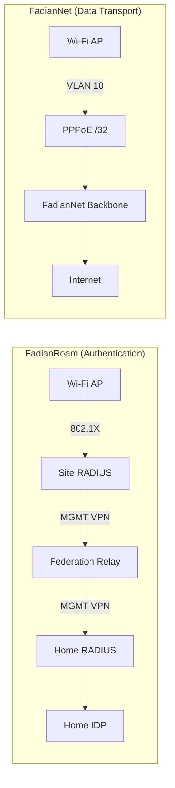
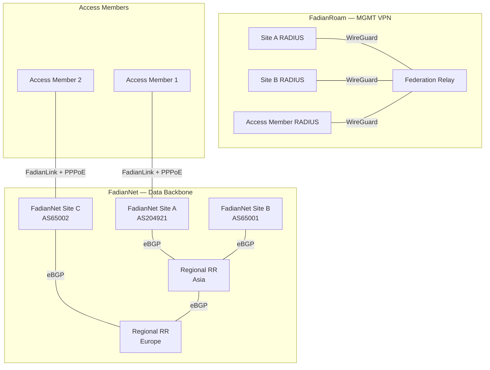

# 网络设计

FadianRoam 的网络分为两个独立的平面：**FadianRoam**（认证）和 **FadianNet**（数据传输）。它们服务于不同目的，但协同工作以提供无缝漫游 Wi-Fi。

## FadianRoam 与 FadianNet 对比



| | FadianRoam | FadianNet |
|---|---|---|
| **用途** | 802.1X 认证与漫游 | 用户数据传输与互联网接入 |
| **传输方式** | MGMT VPN（WireGuard 星型拓扑） | BGP 骨干网（VPN mesh + eBGP） |
| **流量类型** | RADIUS（UDP 1812/1813） | 用户互联网流量 |
| **参与者** | 所有站点 | FadianNet 站点（提供者）+ Access Member（使用者） |
| **性质** | FadianRoam 项目基础设施 | 由 BGP 站点维护的公共骨干网 |

## 架构概览



## FadianRoam 层：MGMT VPN

用途：仅承载 RADIUS 认证代理流量。

| 属性 | 值 |
|----------|-------|
| 传输协议 | WireGuard（星型拓扑，非 mesh） |
| 子网 | `172.172.10.0/24` |
| Relay IP | `172.172.10.1` |
| 成员 IP | 加入时分配（例如 `172.172.10.10`） |
| 流量类型 | 仅限 RADIUS（UDP 1812/1813） |
| 是否必需 | 是，所有 FadianRoam 站点均需 |

每个成员建立一条至 Federation Relay 的 WireGuard 隧道。此隧道专用于 RADIUS 代理流量。非 mesh 拓扑——所有成员仅连接至中心 Relay。

所有 FadianRoam 站点均需连接 MGMT VPN，无论是否同时参与 FadianNet。

## FadianNet 层：数据骨干网

用途：在 802.1X 认证完成后承载用户互联网流量。

FadianNet 是数据平面——承载用户流量至互联网的实际网络。由 FadianNet 站点作为**公共基础设施**共同维护。

### FadianNet 角色

参与 FadianNet 的站点分为两种角色：

| 角色 | 描述 | 要求 |
|------|-------------|--------------|
| **FadianNet 站点**（提供者 + 使用者） | 运营 BGP，向他人提供网络服务并使用 FadianNet | 自有 ASN、BGP 守护进程、公网 IP、FadianNet VPN |
| **Access Member**（仅使用者） | 通过 FadianNet 站点连接 FadianNet，使用网络但不提供传输服务 | MGMT VPN + 至 FadianNet 站点的 FadianLink |

```
FadianNet Site (Provider + User)
  ├── Has own ASN, peers with Regional RR
  ├── Announces shared prefix to upstream (RPKI)
  ├── Provides transit to Access Members via FadianLink
  └── Runs PPPoE server for Access Members

Access Member (User only)
  ├── Connects MGMT VPN (for RADIUS federation)
  ├── Connects to a FadianNet Site via FadianLink
  ├── Dials PPPoE to get /32, NATs AP users behind it
  └── All traffic routes through upstream FadianNet Site
```

同时提供 BGP 传输服务的 FadianRoam 站点兼具 **FadianRoam 站点**（认证）和 **FadianNet 站点**（数据）双重身份。没有 BGP 的站点仅加入 FadianRoam 进行认证，并作为 Access Member 通过 FadianNet 传输数据。

### 拓扑结构

FadianNet 站点使用自有 ASN 通过 eBGP 与 **Regional Route Reflector** 对等：

```
          RR Asia ←── eBGP ──→ RR Europe
           ▲  ▲                  ▲  ▲
          /    \                /    \
    Site A    Site B      Site C    Site D
   AS204921  AS65001     AS65002   AS65003
       │                     │
       └── Access Member 1   └── Access Member 2
           (via FadianLink)      (via FadianLink)
```

- RR **不是** iBGP Route Reflector——每个站点使用自己的 ASN
- RR 聚合路由并在区域间重新分发
- RR 之间互相对等以实现跨区域可达性

## FadianLink

FadianLink 连接 FadianNet 站点与 Access Member，使没有 BGP 的站点也能使用 FadianNet 数据平面。

```
Access Member (no ASN)
    │
    └── VPN ──→ FadianNet Site (AS204921)
                    │
                    ├── PPPoE server assigns /32 to Access Member
                    ├── Announces Access Member's /32 into FadianNet
                    └── Provides default route to Access Member
```

### 对于 FadianNet 站点

- 为连接的 Access Member 运行 PPPoE 服务器
- 代表 Access Member 将其 /32 路由宣告至 FadianNet
- 向 Access Member 提供默认路由（互联网网关）
- 自行选择服务哪些 Access Member

### 对于 Access Member

- 通过 VPN 连接至提供 FadianLink 的 FadianNet 站点
- 拨号 PPPoE 获取 /32 地址，对 AP 用户进行 NAT
- 所有流量通过上游 FadianNet 站点路由
- 无需 ASN，无需 BGP 配置

### 对比

| | FadianNet 站点 | Access Member（通过 FadianLink） |
|---|---|---|
| ASN | 自有 ASN | 无 |
| BGP 对等 | 直接与 Regional RR 对等 | 无——由 FadianNet 站点代为对等 |
| /32 宣告 | 自行宣告 | 由 FadianNet 站点代为宣告 |
| /24 上游宣告 | 向自有上游宣告 | 不适用 |
| 互联网路径 | 自有上行链路 | 通过 FadianNet 站点的上行链路 |
| RPKI | 签署 ROA | 不适用 |

## VLAN 架构

每个 FadianRoam 站点必须使用 VLAN 将 FadianRoam 流量与本地网络流量隔离：

```
AP
 ├── SSID: FadianRoam ──→ VLAN 10 ──→ FadianNet (PPPoE /32)
 └── SSID: Local        ──→ VLAN 20 ──→ Local internet uplink
```

| VLAN | SSID | 流量路径 | 用途 |
|------|------|-------------|---------|
| 10 | `FadianRoam` | AP → FadianNet 骨干网 → 互联网 | 联邦漫游流量，802.1X 认证 |
| 20 | 站点自定义 | AP → 本地网关 → 互联网 | 站点自有本地网络，不属于 FadianRoam |

### 为什么需要 VLAN 隔离？

- **流量统计**：FadianRoam 流量可按站点计量和归属
- **公平使用管控**：带宽限制仅应用于 VLAN 10
- **安全性**：FadianRoam 用户无法访问站点的本地网络
- **商业清晰度**：如果站点将 FadianRoam 商业化，仅 VLAN 10 的流量计入计费

### AP 要求

- AP 必须支持**多 SSID 与 VLAN 标记**
- `FadianRoam` SSID 必须标记到专用 VLAN
- FadianRoam VLAN 必须专门通过 FadianNet 数据平面（PPPoE 隧道）路由
- 本地 VLAN **不得**承载 FadianRoam 流量

## 数据平面设计——进行中的讨论

!!! warning "设计决策进行中"
    FadianNet 数据平面路由模型目前正在评估中。两个方案正在考虑中。欢迎社区贡献意见——请在 [Telegram 群组](https://t.me/+WLLU-KOXcQFiMTg1)中讨论或在 [YunZheng HelpCentre](https://helpdesk.yunzheng.space) 提交工单。

### 方案 A：共享公共前缀（Anycast 模型）

一个赞助的 **/24 前缀**由所有 FadianNet 站点宣告，内部使用 /32 路由进行逐站点寻址。

```
External (public internet):
  All FadianNet Sites announce X.X.X.0/24 via own ASN
  RPKI ROAs authorize multiple ASes for the same /24
  → External traffic enters via nearest FadianNet Site (anycast)

Internal (FadianNet eBGP):
  Site A (AS204921): X.X.X.1/32 + X.X.X.5/32 (Access Member)
  Site B (AS65001):  X.X.X.2/32 + X.X.X.8/32 (Access Member)
  → /32 routes propagate freely between all FadianNet Sites
```

**工作原理**：

1. 每个 FadianNet 站点向其自有上游提供商宣告聚合 /24（RPKI 有效）
2. 每个站点/Access Member 从共享前缀中获分配一个 /32（通过 PPPoE）
3. 内部 /32 细粒度路由通过 Regional RR eBGP 传播
4. 外部流量通过最近的宣告 FadianNet 站点进入（anycast），然后内部路由至正确的 /32
5. 用户通过 FadianNet 骨干网访问互联网——流量从最近的 FadianNet 站点出口

| 属性 | 值 |
|----------|-------|
| 公共前缀 | 赞助的 /24（待定） |
| RPKI | Multi-AS ROA——每个 FadianNet 站点的 ASN 均获授权 |
| 外部路由 | Anycast /24，最近入口 |
| 内部路由 | 每站点 /32，通过 Regional RR 进行 eBGP |
| IP 分配 | 共享前缀中的 /32，通过 PPPoE 分配 |
| 用户流量路径 | AP → VLAN 10 → PPPoE /32 → FadianNet → 最近出口 → 互联网 |

**优点**：

- 统一的公共地址空间——所有 FadianRoam 用户共享一个可路由的 /24
- Anycast 入口——外部流量从地理位置最近的 FadianNet 站点进入
- 清晰隔离——FadianRoam 流量可通过前缀识别
- Access Member 无需自有 IP 资源
- 可扩展——支持通过 /32 分配服务众多站点

**缺点**：

- 需要赞助的 /24 前缀
- RPKI multi-AS ROA 管理增加运维复杂度
- 依赖前缀赞助者

---

### 方案 B：内部环回 + 归属路由

FadianNet 使用**内部 /24**作为环回地址（类似 OSPF/IGP），漫游用户的流量通过隧道回传至其归属站点进行互联网接入。

```
Internal (FadianNet):
  Site A loopback: 172.172.11.1
  Site B loopback: 172.172.11.2
  Access Member loopback: 172.172.11.5
  → Internal reachability via eBGP loopback routes

User traffic flow:
  User@Site_B connects at Site_A AP
  → Traffic tunneled back to Site_B (home) → Site_B uplink → Internet
```

**工作原理**：

1. FadianNet 站点通过 eBGP 使用内部环回地址（/24）对等
2. 当用户漫游时，其流量通过隧道回传至归属站点
3. 归属站点通过自有上行链路提供互联网接入
4. 无需共享公共前缀——每个站点使用自己的 IP 资源

| 属性 | 值 |
|----------|-------|
| 公共前缀 | 无（每个站点使用自有） |
| 内部路由 | 环回 /24，FadianNet 站点间 eBGP |
| 用户流量路径 | AP → 隧道回传至归属站点 → 归属站点上行链路 → 互联网 |

**优点**：

- 不依赖赞助前缀
- 每个站点使用自有 IP 资源和上行链路
- RPKI 更简单——无需 multi-AS ROA 协调

**缺点**：

- **链路成本不均**：漫游流量必须回传至归属站点，可能穿越多个跳。在亚洲站点连接的欧洲用户，其流量需要一路回传至欧洲后才能访问互联网。
- **强制 BGP 绑定**：没有 BGP 的 Access Member 在传输和归属路由上都依赖 FadianNet 站点，形成紧密耦合。
- **漫游用户延迟更高**：流量始终从归属站点出口，而非最近出口。

---

### 方案对比

| 方面 | 方案 A（共享前缀） | 方案 B（归属路由） |
|--------|---------------------------|--------------------------|
| 公网 IP 资源 | 共享赞助的 /24 | 各站点自有 |
| 外部流量入口 | 最近的 FadianNet 站点（anycast） | 仅归属站点 |
| 漫游延迟 | 低（最近出口） | 高（隧道至归属站点） |
| RPKI 复杂度 | Multi-AS ROA | 逐站点 ROA |
| Access Member 依赖 | 从骨干网获取 PPPoE /32 | 隧道回传至赞助者 |
| 是否需要前缀赞助 | 是 | 否 |
| 可扩展性 | 高 | 受限于归属路由开销 |

!!! note "当前倾向"
    方案 A（共享公共前缀）是首选方向。它通过 anycast 路由提供更好的用户体验、更清晰的流量统计以及更低的漫游延迟。主要前提是获得赞助的 /24 前缀。

    讨论仍在进行中——欢迎加入 [Telegram 群组](https://t.me/+WLLU-KOXcQFiMTg1)参与讨论。

## 内部寻址

| 网络 | 子网 | 用途 |
|---------|--------|---------|
| MGMT | `172.172.10.0/24` | RADIUS Relay 隧道（FadianRoam） |
| FadianNet 环回 | `172.172.11.0/24` | FadianNet 站点的 Router ID |
| FadianNet 点对点 | `172.172.12.0/24` | VPN 点对点链路 |
| FadianRoam 前缀 | `TBD /24` | PPPoE 分配的成员 IP（方案 A） |
| FadianRoam v6 | `TBD` | IPv6 分配 |

## 流量流向

漫游用户在 Access Member 站点的端到端流程：

```
1. User connects to FadianRoam SSID → 802.1X authentication
2. AP → Site RADIUS → MGMT VPN → Federation Relay → Home RADIUS → IDP
3. Access-Accept → User gets Wi-Fi on VLAN 10
4. User traffic → VLAN 10 → PPPoE /32 → FadianLink VPN → FadianNet Site → Internet
```

## 成员类型与要求

| 要求 | FadianNet 站点（提供者 + 使用者） | Access Member（仅使用者） |
|-------------|----------------------------------|---------------------------|
| 至 Relay 的 MGMT VPN | 必需 | 必需 |
| FadianNet VPN | 直连 Regional RR | 通过 FadianLink 至 FadianNet 站点 |
| PPPoE 拨号 | 必需 | 必需 |
| 自有 ASN | 必需 | 非必需 |
| eBGP 会话 | 必需 | 非必需 |
| RPKI（ROA） | 必需 | 非必需 |
| /24 上游宣告 | 必需 | 非必需 |
| 支持 802.1X 的 Wi-Fi AP | 必需 | 必需 |
| 公网 IP | 推荐 | 非必需 |
