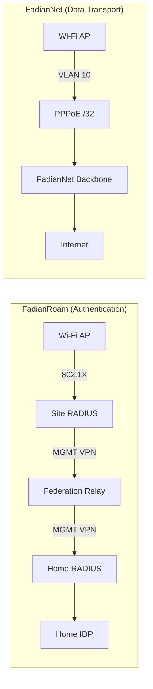
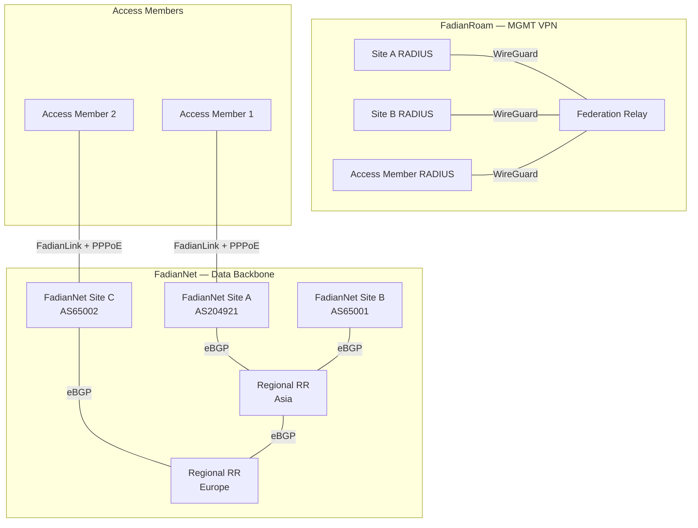
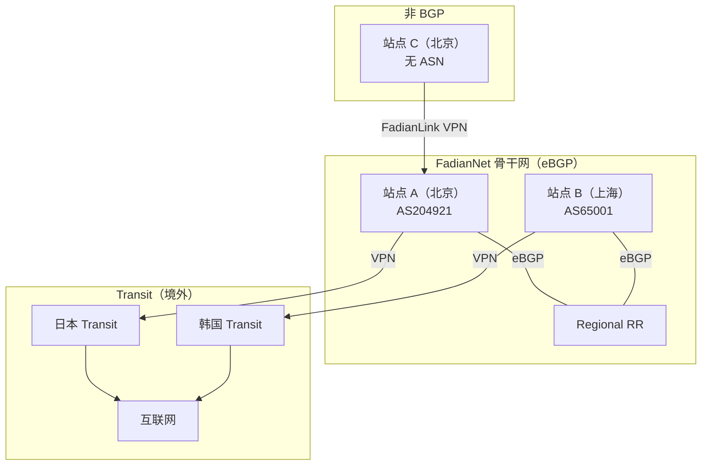

# 网络设计

FadianRoam 的网络分为两个独立的平面：**FadianRoam**（认证）和 **FadianNet**（数据传输）。它们服务于不同目的，但协同工作以提供无缝漫游 Wi-Fi。

## FadianRoam 与 FadianNet 对比



| | FadianRoam | FadianNet |
|---|---|---|
| **用途** | 802.1X 认证与漫游 | 用户数据传输与互联网接入 |
| **传输方式** | MGMT VPN（WireGuard 星型拓扑） | BGP 骨干网（VPN mesh + eBGP） |
| **流量类型** | RADIUS（UDP 1812/1813） | 用户互联网流量 |
| **参与者** | 所有站点 | FadianNet 站点（提供者）+ Access Member（使用者） |
| **性质** | FadianRoam 项目基础设施 | 由 BGP 站点维护的公共骨干网 |

## 架构概览



## FadianRoam 层：MGMT VPN

用途：仅承载 RADIUS 认证代理流量。

| 属性 | 值 |
|----------|-------|
| 传输协议 | WireGuard（星型拓扑，非 mesh） |
| 子网 | `172.172.10.0/24` |
| Relay IP | `172.172.10.1` |
| 成员 IP | 加入时分配（例如 `172.172.10.10`） |
| 流量类型 | 仅限 RADIUS（UDP 1812/1813） |
| 是否必需 | 是，所有 FadianRoam 站点均需 |

每个成员建立一条至 Federation Relay 的 WireGuard 隧道。此隧道专用于 RADIUS 代理流量。非 mesh 拓扑——所有成员仅连接至中心 Relay。

所有 FadianRoam 站点均需连接 MGMT VPN，无论是否同时参与 FadianNet。

## FadianNet 层：数据骨干网

用途：在 802.1X 认证完成后承载用户互联网流量。

FadianNet 是数据平面——承载用户流量至互联网的实际网络。由 FadianNet 站点作为**公共基础设施**共同维护。

### FadianNet 角色

参与 FadianNet 的站点分为两种角色：

| 角色 | 描述 | 要求 |
|------|-------------|--------------|
| **FadianNet 站点**（提供者 + 使用者） | 运营 BGP，向他人提供网络服务并使用 FadianNet | 自有 ASN、BGP 守护进程、公网 IP、FadianNet VPN |
| **Access Member**（仅使用者） | 通过 FadianNet 站点连接 FadianNet，使用网络但不提供传输服务 | MGMT VPN + 至 FadianNet 站点的 FadianLink |

```
FadianNet Site (Provider + User)
  ├── Has own ASN, peers with Regional RR
  ├── Announces shared prefix to upstream (RPKI)
  ├── Provides transit to Access Members via FadianLink
  └── Runs PPPoE server for Access Members

Access Member (User only)
  ├── Connects MGMT VPN (for RADIUS federation)
  ├── Connects to a FadianNet Site via FadianLink
  ├── Dials PPPoE to get /32, NATs AP users behind it
  └── All traffic routes through upstream FadianNet Site
```

同时提供 BGP 传输服务的 FadianRoam 站点兼具 **FadianRoam 站点**（认证）和 **FadianNet 站点**（数据）双重身份。没有 BGP 的站点仅加入 FadianRoam 进行认证，并作为 Access Member 通过 FadianNet 传输数据。

!!! info "类比：类似 RIPE LIR / Enduser"
    这种结构类似于 RIPE NCC 的 LIR / Enduser 模型 — FadianNet 站点类似于 LIR（运营基础设施、赞助下游成员），而没有 BGP 的站点类似于 Enduser（通过当地 LIR 加入）。这只是描述关系的类比，并非实际命名。

### 非 BGP 站点加入

没有 BGP 的站点无法直接加入 FadianNet。要参与 FadianRoam，需要：

1. 找到所在地区**最近的 FadianNet + FadianRoam 站点**（即「赞助者」）
2. 赞助者同意提供 FadianLink 连接
3. **赞助者代为提交申请 PR** 到联盟投票
4. 联盟投票（>50%，3 天）— 赞助者为申请者担保
5. 通过后，非 BGP 站点通过 FadianLink 连接到赞助者并部署 FadianRoam AP

赞助者的 BGP 站点成为非 BGP 站点的互联网出口 — 所有漫游流量都会路由回赞助者。

### 拓扑结构

FadianNet 站点使用自有 ASN 通过 eBGP 与 **Regional Route Reflector** 对等：

```
          RR Asia ←── eBGP ──→ RR Europe
           ▲  ▲                  ▲  ▲
          /    \                /    \
    Site A    Site B      Site C    Site D
   AS204921  AS65001     AS65002   AS65003
       │                     │
       └── Access Member 1   └── Access Member 2
           (via FadianLink)      (via FadianLink)
```

- RR **不是** iBGP Route Reflector——每个站点使用自己的 ASN
- RR 聚合路由并在区域间重新分发
- RR 之间互相对等以实现跨区域可达性

## FadianLink

FadianLink 连接 FadianNet 站点与 Access Member，使没有 BGP 的站点也能使用 FadianNet 数据平面。

```
Access Member (no ASN)
    │
    └── VPN ──→ FadianNet Site (AS204921)
                    │
                    ├── PPPoE server assigns /32 to Access Member
                    ├── Announces Access Member's /32 into FadianNet
                    └── Provides default route to Access Member
```

### 对于 FadianNet 站点

- 为连接的 Access Member 运行 PPPoE 服务器
- 代表 Access Member 将其 /32 路由宣告至 FadianNet
- 向 Access Member 提供默认路由（互联网网关）
- 自行选择服务哪些 Access Member

### 对于 Access Member

- 通过 VPN 连接至提供 FadianLink 的 FadianNet 站点
- 拨号 PPPoE 获取 /32 地址，对 AP 用户进行 NAT
- 所有流量通过上游 FadianNet 站点路由
- 无需 ASN，无需 BGP 配置

### 对比

| | FadianNet 站点 | Access Member（通过 FadianLink） |
|---|---|---|
| ASN | 自有 ASN | 无 |
| BGP 对等 | 直接与 Regional RR 对等 | 无——由 FadianNet 站点代为对等 |
| /32 宣告 | 自行宣告 | 由 FadianNet 站点代为宣告 |
| /24 上游宣告 | 向自有上游宣告 | 不适用 |
| 互联网路径 | 自有上行链路 | 通过 FadianNet 站点的上行链路 |
| RPKI | 签署 ROA | 不适用 |

## VLAN 架构

每个 FadianRoam 站点必须使用 VLAN 将 FadianRoam 流量与本地网络流量隔离：

```
AP
 ├── SSID: FadianRoam ──→ VLAN 10 ──→ FadianNet (PPPoE /32)
 └── SSID: Local        ──→ VLAN 20 ──→ Local internet uplink
```

| VLAN | SSID | 流量路径 | 用途 |
|------|------|-------------|---------|
| 10 | `FadianRoam` | AP → FadianNet 骨干网 → 互联网 | 联邦漫游流量，802.1X 认证 |
| 20 | 站点自定义 | AP → 本地网关 → 互联网 | 站点自有本地网络，不属于 FadianRoam |

### 为什么需要 VLAN 隔离？

- **流量统计**：FadianRoam 流量可按站点计量和归属
- **公平使用管控**：带宽限制仅应用于 VLAN 10
- **安全性**：FadianRoam 用户无法访问站点的本地网络
- **商业清晰度**：如果站点将 FadianRoam 商业化，仅 VLAN 10 的流量计入计费

### AP 要求

- AP 必须支持**多 SSID 与 VLAN 标记**
- `FadianRoam` SSID 必须标记到专用 VLAN
- FadianRoam VLAN 必须专门通过 FadianNet 数据平面（PPPoE 隧道）路由
- 本地 VLAN **不得**承载 FadianRoam 流量

## 数据平面设计——进行中的讨论

!!! warning "设计决策进行中"
    FadianNet 数据平面路由模型目前正在评估中。两个方案正在考虑中。欢迎社区贡献意见——请在 [Telegram 群组](https://t.me/+WLLU-KOXcQFiMTg1)中讨论或在 [YunZheng HelpCentre](https://helpdesk.yunzheng.space) 提交工单。

### 方案 A：共享公共前缀（Anycast 模型）

一个赞助的 **/24 前缀**由所有 FadianNet 站点宣告，内部使用 /32 路由进行逐站点寻址。

```
External (public internet):
  All FadianNet Sites announce X.X.X.0/24 via own ASN
  RPKI ROAs authorize multiple ASes for the same /24
  → External traffic enters via nearest FadianNet Site (anycast)

Internal (FadianNet eBGP):
  Site A (AS204921): X.X.X.1/32 + X.X.X.5/32 (Access Member)
  Site B (AS65001):  X.X.X.2/32 + X.X.X.8/32 (Access Member)
  → /32 routes propagate freely between all FadianNet Sites
```

**工作原理**：

1. 每个 FadianNet 站点向其自有上游提供商宣告聚合 /24（RPKI 有效）
2. 每个站点/Access Member 从共享前缀中获分配一个 /32（通过 PPPoE）
3. 内部 /32 细粒度路由通过 Regional RR eBGP 传播
4. 外部流量通过最近的宣告 FadianNet 站点进入（anycast），然后内部路由至正确的 /32
5. 用户通过 FadianNet 骨干网访问互联网——流量从最近的 FadianNet 站点出口

| 属性 | 值 |
|----------|-------|
| 公共前缀 | 赞助的 /24（待定） |
| RPKI | Multi-AS ROA——每个 FadianNet 站点的 ASN 均获授权 |
| 外部路由 | Anycast /24，最近入口 |
| 内部路由 | 每站点 /32，通过 Regional RR 进行 eBGP |
| IP 分配 | 共享前缀中的 /32，通过 PPPoE 分配 |
| 用户流量路径 | AP → VLAN 10 → PPPoE /32 → FadianNet → 最近出口 → 互联网 |

**优点**：

- 统一的公共地址空间——所有 FadianRoam 用户共享一个可路由的 /24
- Anycast 入口——外部流量从地理位置最近的 FadianNet 站点进入
- 清晰隔离——FadianRoam 流量可通过前缀识别
- Access Member 无需自有 IP 资源
- 可扩展——支持通过 /32 分配服务众多站点

**缺点**：

- 需要赞助的 /24 前缀
- RPKI multi-AS ROA 管理增加运维复杂度
- 依赖前缀赞助者

---

### 方案 B：内部环回 + 归属路由（BGP 骨干网）

FadianNet 使用**内部 /24**作为环回地址（类似 OSPF/IGP）。所有 FadianNet 站点**必须具备 BGP** — 这是骨干网运行的强制要求。漫游用户的流量通过骨干网路由回归属站点进行互联网接入。

```
FadianNet 骨干网（eBGP mesh，通过 Regional RR）
│
├── FadianNet 站点 A (AS204921) ← loopback 172.172.11.1，自有互联网出口
│   ├── FadianRoam AP（自有用户 → 在站点 A 出网）
│   └── 非 BGP 站点 X（FadianRoam AP → 漫游回站点 A 出网）
│
├── FadianNet 站点 B (AS65001) ← loopback 172.172.11.2，自有互联网出口
│   ├── FadianRoam AP（自有用户 → 在站点 B 出网）
│   └── 非 BGP 站点 Y（FadianRoam AP → 漫游回站点 B 出网）
│
└── FadianNet 站点 C (AS65002) ← loopback 172.172.11.3，自有互联网出口
    └── FadianRoam AP（自有用户 → 在站点 C 出网）
```

**工作原理**：

1. 所有 FadianNet 站点通过 eBGP 对等（各自使用自有 ASN），组成虚拟 BGP 骨干网
2. 每个站点拥有来自内部前缀的环回 IP；/32 环回路由通过 eBGP 经 Regional RR 传播
3. 当用户漫游到访问站点时，其流量通过骨干网路由回**归属站点**（为其提供 FadianRoam 接入的 FadianNet 站点）
4. 归属站点通过自有上行链路提供互联网接入
5. 非 BGP 站点通过 FadianLink 连接到赞助的 FadianNet 站点；其用户流量路由回赞助者出口

**漫游场景**：

```
场景 1：BGP 站点用户漫游
  用户注册在站点 A → 在站点 C 的 AP 连接
  → 通过 MGMT VPN 认证（FadianRoam）
  → 数据：站点 C → FadianNet 骨干网 → 站点 A（归属）→ 互联网

场景 2：非 BGP 站点用户漫游
  用户注册在非 BGP 站点 X（赞助者：站点 A）→ 在站点 B 的 AP 连接
  → 通过 MGMT VPN 认证（FadianRoam）
  → 数据：站点 B → FadianNet 骨干网 → 站点 A（赞助者）→ 互联网
```

#### 真实场景示例

考虑一个所有站点都使用境外 Transit 的场景（例如中国大陆没有 IP Transit 服务的情况）：

```
站点 A（北京，自有 AS）
  └── VPN → 日本 Transit → 互联网
  └── FadianRoam AP 部署在北京家中

站点 B（上海，自有 AS）
  └── VPN → 韩国 Transit → 互联网
  └── FadianRoam AP 部署在上海家中

站点 C（北京，无 BGP）
  └── 由站点 A 赞助
  └── VPN → 站点 A 北京 PoP → A 的 FadianNet → 互联网
  └── FadianRoam AP 部署在北京家中
```



**正常使用（无漫游）**：

- 站点 A 的用户在 A 的 AP 连接 → 流量通过 A 的日本 Transit 出网
- 站点 B 的用户在 B 的 AP 连接 → 流量通过 B 的韩国 Transit 出网
- 站点 C 的用户在 C 的 AP 连接 → 流量通过 A 的 FadianNet → 经 A 的日本 Transit 出网
- 在 FadianNet 内部，A 和 B 通过 eBGP 交换路由 — A 可以根据 BGP 路径选择，将部分流量通过 B 的韩国 Transit 出网（反之亦然）

**A 的用户漫游到 B 家（上海）**：

1. A 的用户连接 B 的 FadianRoam AP
2. 认证：B 的 RADIUS → MGMT VPN → Federation Relay → A 的 RADIUS → A 的 IDP → Access-Accept
3. 数据：B 的 AP → FadianNet 骨干网 → 漫游回 **A 的北京站点** → A 的日本 Transit → 互联网
4. 部分路由可能仍然被 BGP 选择走 B 的韩国出口 — 这种绕路是可以接受的，必要时可以通过路由策略调整

**C 的用户漫游到 B 家（上海）**：

1. C 的用户连接 B 的 FadianRoam AP
2. 认证：B 的 RADIUS → MGMT VPN → Federation Relay → **C 的 RADIUS** → C 的 IDP → Access-Accept（C 有自己的 MGMT VPN 到 Federation Relay）
3. 数据：B 的 AP → FadianNet 骨干网 → 漫游回 **A 的北京站点**（C 的赞助者）→ A 的日本 Transit → 互联网

!!! info "认证路径 vs 数据路径"
    认证始终路由到**用户自身的 FadianRoam 站点**（每个站点都有独立的 MGMT VPN 到 Federation Relay）。数据始终路由到用户的**归属 FadianNet 站点**（提供互联网出口的 BGP 站点）。对于非 BGP 站点，两者是不同的：认证走 C，数据走 A（C 的赞助者）。

!!! note "路由绕路"
    在默认 FadianNet 路由下，部分路径可能不是最优的 — 例如从 B 漫游回 A 的流量可能仍然被 BGP 最佳路径选择走 B 的韩国出口。这是正常的 BGP 行为，对社区网络而言可以接受。各站点可以协调调整路由策略，但归属路由模型下一定程度的绕路是不可避免的。

| 属性 | 值 |
|----------|-------|
| 公共前缀 | 无（每个站点使用自有） |
| 内部路由 | 环回 /24，FadianNet 站点间 eBGP |
| BGP 要求 | **强制**，所有 FadianNet 站点必须具备 |
| 用户流量路径 | AP → FadianNet 骨干网 → 归属站点 → 归属站点上行链路 → 互联网 |
| 非 BGP 站点路径 | AP → FadianNet 骨干网 → 赞助站点 → 赞助站点上行链路 → 互联网 |

**优点**：

- 不依赖赞助前缀——每个站点使用自有 IP 资源
- RPKI 更简单——无需 multi-AS ROA 协调
- 强制 BGP 确保骨干网质量——每个参与者都贡献路由
- 非 BGP 站点有清晰的赞助模型
- 流量统计清晰——每个站点的出口流量可计量

**缺点**：

- **漫游延迟较高**：流量始终从归属站点出口，而非最近出口。在欧洲站点连接的亚洲用户，流量需路由回亚洲。
- **跨区域带宽成本**：长距离漫游消耗区域间骨干网带宽。
- **赞助者依赖**：非 BGP 站点完全依赖赞助者的互联网出口。

---

### 方案对比

| 方面 | 方案 A（共享前缀） | 方案 B（归属路由） |
|--------|---------------------------|--------------------------|
| 公网 IP 资源 | 共享赞助的 /24 | 各站点自有 |
| 外部流量入口 | 最近的 FadianNet 站点（anycast） | 仅归属站点 |
| 漫游延迟 | 低（最近出口） | 高（隧道至归属站点） |
| RPKI 复杂度 | Multi-AS ROA | 逐站点 ROA |
| Access Member 依赖 | 从骨干网获取 PPPoE /32 | 隧道回传至赞助者 |
| 是否需要前缀赞助 | 是 | 否 |
| 可扩展性 | 高 | 受限于归属路由开销 |

!!! note "当前倾向"
    方案 B（内部环回 + 归属路由）是当前首选方向。它强制所有骨干网参与者具备 BGP，为非 BGP 站点提供清晰的赞助模型，且不依赖赞助前缀。代价是漫游延迟较高，但对于社区网络而言可以接受。

    两个方案仍在考虑中——欢迎加入 [Telegram 群组](https://t.me/+WLLU-KOXcQFiMTg1)参与讨论。

!!! quote "社区讨论"
    **Jack（AS153376）** 提出了一个问题：如果一个 ORG 的用户特别多，在各地都有大量用户连接到 FadianRoam 节点（例如 JianyuelabLTD），那这个站点是否应该被视为商业使用？

    **回复**：如果是商业情境，委员会应该设立一个在 FadianRoam 上的使用标准，以「配额」为单位。超出爱好配额的部分，对应的网络成本由所有 BGP Sites 均摊（固定配额价值）。每个 ORG 产生的爱好配额以外的部分，由该 ORG 承担对应的 BGP Sites 付出的额外平摊成本。

## 内部寻址

| 网络 | 子网 | 用途 |
|---------|--------|---------|
| MGMT | `172.172.10.0/24` | RADIUS Relay 隧道（FadianRoam） |
| FadianNet 环回 | `172.172.11.0/24` | FadianNet 站点的 Router ID |
| FadianNet 点对点 | `172.172.12.0/24` | VPN 点对点链路 |
| FadianRoam 前缀 | `TBD /24` | PPPoE 分配的成员 IP（方案 A） |
| FadianRoam v6 | `TBD` | IPv6 分配 |

## IPv6-Only 站点：464XLAT

没有公网 IPv4 的站点可以通过 **[464XLAT](https://soha.moe/post/ipv6-only-preferred-at-home.html)**（RFC 6877）参与 FadianNet。这允许 IPv6-only 站点为用户设备提供完整的 IPv4 连接：

```
用户设备（IPv4 应用）
    → CLAT（客户端侧转换，在 AP/网关上）
    → IPv6-only FadianNet 传输
    → PLAT（提供者侧转换，在 FadianNet 站点上）
    → IPv4 互联网
```

这降低了仅有 IPv6 连接的 Access Member 的准入门槛——无需公网 IPv4 分配。

## 流量流向

漫游用户在 Access Member 站点的端到端流程：

```
1. User connects to FadianRoam SSID → 802.1X authentication
2. AP → Site RADIUS → MGMT VPN → Federation Relay → Home RADIUS → IDP
3. Access-Accept → User gets Wi-Fi on VLAN 10
4. User traffic → VLAN 10 → PPPoE /32 → FadianLink VPN → FadianNet Site → Internet
```

## 成员类型与要求

| 要求 | FadianNet 站点（提供者 + 使用者） | Access Member（仅使用者） |
|-------------|----------------------------------|---------------------------|
| 至 Relay 的 MGMT VPN | 必需 | 必需 |
| FadianNet VPN | 直连 Regional RR | 通过 FadianLink 至 FadianNet 站点 |
| PPPoE 拨号 | 必需 | 必需 |
| 自有 ASN | 必需 | 非必需 |
| eBGP 会话 | 必需 | 非必需 |
| RPKI（ROA） | 必需 | 非必需 |
| /24 上游宣告 | 必需 | 非必需 |
| 支持 802.1X 的 Wi-Fi AP | 必需 | 必需 |
| 公网 IP | 推荐 | 非必需 |
