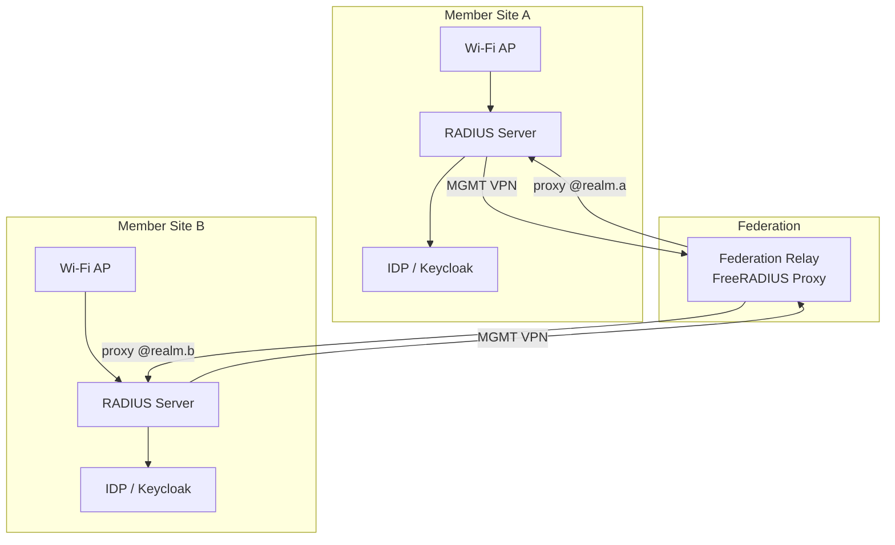

# Architecture Overview

FadianRoam is a federated roaming network with three layers: **Authentication**, **Management**, and **Data**.

## System Diagram

## Layers

### 1. Authentication Layer

Each member operates an **IDP** (e.g., Keycloak) and a **RADIUS server** (e.g., FreeRADIUS). Users authenticate as `username@member-realm`. The RADIUS server validates credentials against the local IDP via ROPC (Resource Owner Password Credentials).

When a user from Site B connects at Site A:

1. Site A's AP sends RADIUS request to Site A's RADIUS
2. Site A's RADIUS sees `@realm.b` and proxies to the **Federation Relay**
3. The Relay forwards to Site B's RADIUS
4. Site B's RADIUS validates against its local IDP
5. Access-Accept flows back through the chain

### 2. Management Network (MGMT)

Every member's RADIUS server connects to the Federation Relay via a **dedicated MGMT VPN tunnel**. This tunnel carries only RADIUS traffic (UDP 1812/1813) and is used exclusively for authentication proxy.

- Transport: WireGuard
- Addressing: Dedicated internal IP range (e.g., `172.172.10.0/24`)
- Required for all members

### 3. Data Network (FadianNet)

FadianNet is the business network that carries actual user traffic after authentication. Members join FadianNet to provide internet access to roaming users.

- **With BGP**: Members peer via BGP over VPN, contributing transit capacity to the shared backbone
- **Without BGP**: Members connect via VPN-only and receive a default route from the federation

See [Network Design](network.md) for details.

## Key Principles

- **Decentralized identity**: Each member controls their own users. No central user database.
- **Centralized routing**: The Federation Relay is the only shared RADIUS infrastructure.
- **Open membership**: Join by submitting a PR to the federation repo.
- **Transparent governance**: All configuration is public on GitHub.
