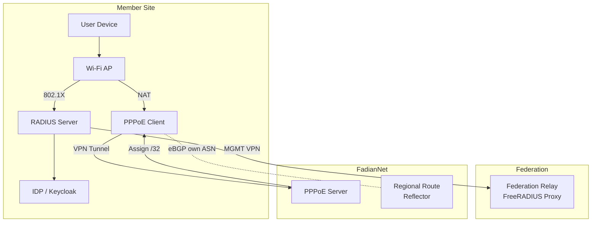

# Architecture Overview

FadianRoam is a federated roaming network with four layers: **Authentication**, **Management**, **Access**, and **Data**.

## System Diagram



## Layers

### 1. Authentication Layer (Wi-Fi)

Each member operates an **IDP** (e.g., Keycloak) and a **RADIUS server** (e.g., FreeRADIUS). Users authenticate as `username@member-realm`. The RADIUS server validates credentials against the local IDP via ROPC (Resource Owner Password Credentials).

When a user from Site B connects at Site A:

1. Site A's AP sends RADIUS request to Site A's RADIUS
2. Site A's RADIUS sees `@realm.b` and proxies to the **Federation Relay**
3. The Relay forwards to Site B's RADIUS
4. Site B's RADIUS validates against its local IDP
5. Access-Accept flows back through the chain

### 2. Management Network (MGMT)

Every member's RADIUS server connects to the Federation Relay via a **dedicated MGMT VPN tunnel**. This tunnel carries only RADIUS traffic (UDP 1812/1813) and is used exclusively for authentication proxy.

- Transport: WireGuard (star topology, no mesh)
- Addressing: `172.172.10.0/24`
- Required for all members

### 3. Access Layer (PPPoE)

After connecting to FadianNet via VPN, each Site must **PPPoE dial-up** to authenticate and obtain network access. PPPoE acts as the business-layer access control:

- Site administrator dials PPPoE over the VPN link
- On success, the Site is assigned a **/32 IP** from the shared FadianRoam prefix
- All user devices behind the AP are **NATed** behind this /32 IP
- PPPoE controls which Sites are actively providing service
- PPPoE Servers are decentralized, sharing a common member credential list

```
VPN connected ≠ network access
VPN connected + PPPoE authenticated = network access
```

### 4. Data Network (FadianNet)

FadianNet is the BGP backbone that carries actual user traffic. Each member uses their **own ASN** and participates in eBGP:

- Each Site announces its assigned **/32** within FadianNet
- **Regional Route Reflectors** aggregate nearby /32 routes
- The full shared **/24 prefix** is announced to the public internet
- No prefix-length filtering within FadianNet (all /32s are accepted)
- External traffic reaches the nearest announcing member (anycast-style)

```
Internal (FadianNet eBGP):
  Site A (AS204921) announces X.X.X.1/32
  Site B (AS65001)  announces X.X.X.2/32
  Site C (AS65002)  announces X.X.X.3/32
  → full /32 reachability between all Sites

External (public eBGP):
  Regional RRs + transit members announce X.X.X.0/24 aggregate
  → external traffic arrives at nearest member
```

See [Network Design](network.md) for details.

## Key Principles

- **Decentralized identity**: Each member controls their own users. No central user database.
- **Centralized authentication routing**: The Federation Relay is the only shared RADIUS infrastructure.
- **Decentralized data plane**: PPPoE servers and Route Reflectors are distributed regionally.
- **Own ASN participation**: Each BGP member uses their own ASN, not a shared one.
- **Open membership**: Join by submitting a PR to the federation repo.
- **Transparent governance**: All configuration is public on GitHub.
