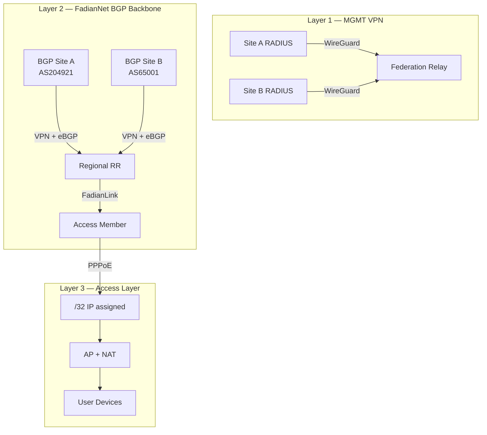

# Architecture Overview

FadianRoam is a federated roaming network built on three network layers plus a virtual peering service.

## System Diagram



## Layer 1: MGMT VPN

**Between**: FadianRoam Sites ↔ Federation Core

Star-topology WireGuard VPN carrying **RADIUS proxy traffic only**. Each Site's RADIUS server connects to the central Federation Relay. When a roaming user authenticates, the request is proxied through this tunnel to the user's home Site.

- Transport: WireGuard (star, no mesh)
- Addressing: `172.172.10.0/24`
- Traffic: RADIUS (UDP 1812/1813) only

### Authentication Flow

1. User connects to AP at Site A as `user@realm.b`
2. Site A RADIUS proxies via MGMT VPN → Federation Relay
3. Relay forwards via MGMT VPN → Site B RADIUS
4. Site B validates against local Keycloak IDP
5. Access-Accept flows back through the chain

## Layer 2: FadianNet (BGP Backbone)

**Between**: BGP Sites ↔ BGP Sites (via Regional RRs)

The data backbone built on VPN + eBGP. Each BGP Site uses its **own public ASN** and peers with regional Route Reflector nodes.

### Shared Prefix

FadianRoam operates a sponsored IPv4 /24 and IPv6 prefix:

| Property | Value |
|----------|-------|
| IPv4 Prefix | `TBD /24` (sponsored) |
| IPv6 Prefix | `TBD` |
| RPKI | Required — all BGP Sites must sign ROAs |

### External Routing

- Every BGP Site announces the **/24 aggregate** to its own upstream (public internet)
- All BGP Sites carry RPKI-valid ROAs for the shared prefix
- External traffic reaches the nearest announcing BGP Site (anycast)

### Internal Routing

- Within FadianNet peering, **/32 fine-grained routes** propagate without prefix-length filtering
- Each /32 represents one active Access Member (assigned via PPPoE)
- Internal /32s enable precise Site-to-Site routing

```
Public internet:
  All BGP Sites announce X.X.X.0/24 (RPKI signed)

FadianNet internal:
  Site A (AS204921) propagates X.X.X.1/32, X.X.X.5/32 ...
  Site B (AS65001)  propagates X.X.X.2/32, X.X.X.8/32 ...
  → /32 routes flow freely between all BGP Sites
```

### Regional Route Reflectors

BGP Sites are organized by region. Each region has RR nodes that:

- Collect /32 routes from local BGP Sites
- Exchange routes with other regional RRs
- Act as concentration points (not iBGP RRs — each Site keeps its own ASN)

```
      RR Asia ←── eBGP ──→ RR Europe
       ▲  ▲                  ▲  ▲
      /    \                /    \
Site A    Site B      Site C    Site D
AS204921  AS65001     AS65002   AS65003
```

## Layer 3: Access Layer

**Between**: FadianRoam Sites ↔ FadianNet

Each Site (BGP or Access Member) connects to FadianNet and obtains network access via **PPPoE dial-up**:

1. Site establishes VPN tunnel to a FadianNet node
2. Site dials PPPoE over the VPN
3. PPPoE server assigns a **/32 IP** from the shared prefix
4. Site NATs all AP user devices behind this /32
5. The /32 is announced within FadianNet for internal reachability

```
VPN connected ≠ network access
VPN connected + PPPoE authenticated = active Site
```

PPPoE servers are **decentralized** — regional nodes share a common member credential list.

## FadianLink

**FadianLink** is a virtual BGP peering service built on top of FadianNet VPN links. It bridges BGP Sites and Access Members:

### What It Does

- BGP Sites can offer **virtual BGP transit** to Access Members over existing FadianNet VPN tunnels
- Access Members without an ASN receive a default route from their upstream BGP Site via FadianLink
- BGP Sites that provide FadianLink act as the Access Member's gateway to FadianNet and the internet

### How It Works

```
Access Member (no ASN)
    │
    └── VPN ──→ BGP Site A (AS204921)
                    │
                    ├── Provides default route via FadianLink
                    ├── NATs or routes Access Member's /32 traffic
                    └── Announces Access Member's /32 into FadianNet
```

- Access Member dials PPPoE → gets /32
- BGP Site announces the Access Member's /32 into FadianNet on their behalf
- Access Member's traffic exits through the BGP Site's uplinks

### Why FadianLink?

- **Lowers the barrier**: No ASN needed to join FadianRoam
- **BGP Sites remain the backbone**: They contribute routing, transit, and infrastructure
- **Access Members grow the ecosystem**: More APs, more coverage, more users
- **Market-like dynamics**: BGP Sites can choose which Access Members to serve

## Member Types

### BGP Site

Operates their own ASN. Forms the FadianNet backbone:

- Peers with regional RRs via eBGP
- Announces shared /24 to public internet (with RPKI)
- Propagates /32 routes within FadianNet
- Can provide FadianLink service to Access Members

### Access Member

Does not have an ASN. Joins FadianRoam for coverage:

- Connects to MGMT VPN (for RADIUS federation)
- Connects to a BGP Site via FadianLink
- Dials PPPoE to get /32, NATs AP users behind it
- Traffic routed through upstream BGP Site

## Key Principles

- **Decentralized identity**: Each member controls their own users. No central user database.
- **Centralized authentication routing**: The Federation Relay is the only shared RADIUS infrastructure.
- **Decentralized data plane**: PPPoE servers and Route Reflectors are distributed regionally.
- **BGP-driven backbone**: BGP Sites with their own ASNs form the core network.
- **Open access via FadianLink**: Access Members join without ASN through BGP Site sponsorship.
- **RPKI mandatory**: All BGP Sites must sign ROAs for the shared prefix.
- **Open membership**: Join by submitting a PR to the federation repo.
- **Transparent governance**: All configuration is public on GitHub.
