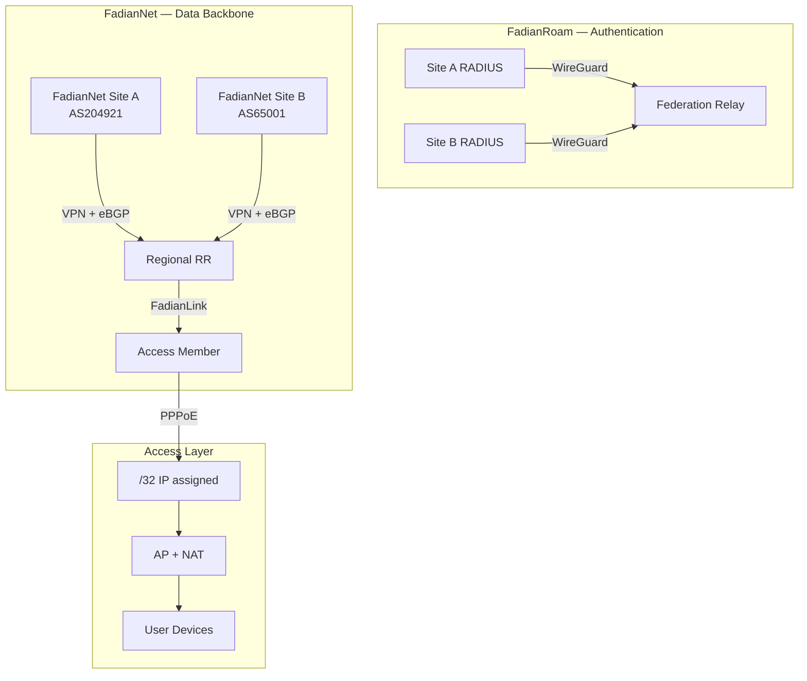

# Architecture Overview

FadianRoam is a federated roaming Wi-Fi network. It is built on two independent planes — **FadianRoam** for authentication and **FadianNet** for data transport — plus a bridging service called FadianLink.

## System Diagram



## Two Planes

### FadianRoam (Authentication Plane)

**Between**: All FadianRoam Sites ↔ Federation Relay

Star-topology WireGuard VPN carrying **RADIUS proxy traffic only**. Each Site's RADIUS server connects to the central Federation Relay. When a roaming user authenticates, the request is proxied through this tunnel to the user's home Site.

- Transport: WireGuard (star, no mesh)
- Addressing: `172.172.10.0/24`
- Traffic: RADIUS (UDP 1812/1813) only
- All FadianRoam Sites connect here, regardless of FadianNet participation

### FadianNet (Data Plane)

**Between**: FadianNet Sites ↔ FadianNet Sites (via Regional RRs)

The data backbone carrying user internet traffic. Maintained collectively by FadianNet Sites as a **public good**. FadianNet is a separate project from FadianRoam — it provides the transport layer that FadianRoam runs on.

- Transport: VPN mesh + eBGP
- Each FadianNet Site uses its own public ASN
- Peers with Regional Route Reflectors
- Access Members connect indirectly via FadianLink

### Authentication Flow

1. User connects to AP at Site A as `user@realm.b`
2. Site A RADIUS proxies via MGMT VPN → Federation Relay
3. Relay forwards via MGMT VPN → Site B RADIUS
4. Site B validates against local IDP
5. Access-Accept flows back through the chain

## FadianNet Roles

FadianNet participants have two distinct roles:

### FadianNet Site (Provider + User)

Operates their own ASN. Forms the FadianNet backbone and provides transit:

- Peers with regional RRs via eBGP
- Announces shared prefix to public internet (with RPKI)
- Propagates routes within FadianNet
- Can provide FadianLink service to Access Members
- Maintains the backbone as a public good

### Access Member (User only)

Does not have an ASN. Joins FadianRoam for Wi-Fi coverage and uses FadianNet for data:

- Connects to MGMT VPN (for RADIUS federation)
- Connects to a FadianNet Site via FadianLink
- Dials PPPoE to get /32, NATs AP users behind it
- Traffic routed through upstream FadianNet Site

## Access Layer (PPPoE)

Each Site (FadianNet Site or Access Member) obtains network access via **PPPoE dial-up**:

1. Site establishes VPN tunnel to a FadianNet node
2. Site dials PPPoE over the VPN
3. PPPoE server assigns a **/32 IP** from the shared prefix
4. Site NATs all AP user devices behind this /32
5. The /32 is announced within FadianNet for internal reachability

```
VPN connected ≠ network access
VPN connected + PPPoE authenticated = active Site
```

PPPoE servers are **decentralized** — regional nodes share a common member credential list.

## FadianLink

**FadianLink** bridges FadianNet Sites and Access Members:

- FadianNet Sites can offer **virtual transit** to Access Members over existing VPN tunnels
- Access Members without an ASN receive a default route from their upstream FadianNet Site
- FadianNet Sites that provide FadianLink act as the Access Member's gateway

```
Access Member (no ASN)
    │
    └── VPN ──→ FadianNet Site A (AS204921)
                    │
                    ├── Provides default route via FadianLink
                    ├── Routes Access Member's /32 traffic
                    └── Announces Access Member's /32 into FadianNet
```

### Why FadianLink?

- **Lowers the barrier**: No ASN needed to join FadianRoam
- **FadianNet Sites remain the backbone**: They contribute routing, transit, and infrastructure
- **Access Members grow the ecosystem**: More APs, more coverage, more users

## Key Principles

- **Decentralized identity**: Each member controls their own users. No central user database.
- **Centralized authentication routing**: The Federation Relay is the only shared RADIUS infrastructure.
- **Decentralized data plane**: PPPoE servers and Route Reflectors are distributed regionally.
- **FadianNet as public good**: FadianNet Sites collectively maintain the backbone on a mutual-aid basis.
- **Open access via FadianLink**: Access Members join without ASN through FadianNet Site sponsorship.
- **RPKI mandatory**: All FadianNet Sites must sign ROAs for the shared prefix.
- **Democratic governance**: Membership requires [>50% federation vote](../governance.md).
- **Transparent**: All configuration is public on GitHub.
