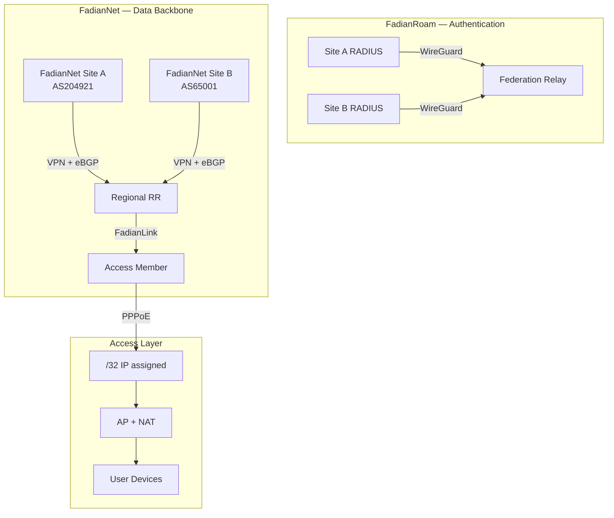

# 架构概述

FadianRoam 是一个联邦制漫游 Wi-Fi 网络。它构建于两个独立的平面之上——用于认证的 **FadianRoam** 和用于数据传输的 **FadianNet**——以及一个名为 FadianLink 的桥接服务。

## 系统架构图



## 两个平面

### FadianRoam（认证平面）

**连接关系**：所有 FadianRoam 站点 ↔ Federation Relay

星型拓扑的 WireGuard VPN，**仅承载 RADIUS 代理流量**。每个站点的 RADIUS 服务器连接到中心 Federation Relay。当漫游用户进行认证时，请求通过此隧道代理至用户的归属站点。

- 传输协议：WireGuard（星型拓扑，非 mesh）
- 地址段：`172.172.10.0/24`
- 流量类型：仅限 RADIUS（UDP 1812/1813）
- 所有 FadianRoam 站点均需连接此网络，无论是否参与 FadianNet

### FadianNet（数据平面）

**连接关系**：FadianNet 站点 ↔ FadianNet 站点（通过 Regional RR）

承载用户互联网流量的数据骨干网。由 FadianNet 站点作为**公共基础设施**共同维护。FadianNet 是独立于 FadianRoam 的项目——它为 FadianRoam 提供传输层。

- 传输协议：VPN mesh + eBGP
- 每个 FadianNet 站点使用自己的公共 ASN
- 与 Regional Route Reflector 对等
- Access Member 通过 FadianLink 间接连接

### 认证流程

1. 用户在站点 A 的 AP 上以 `user@realm.b` 身份连接
2. 站点 A 的 RADIUS 通过 MGMT VPN 代理至 Federation Relay
3. Relay 通过 MGMT VPN 转发至站点 B 的 RADIUS
4. 站点 B 对本地 IDP 进行验证
5. Access-Accept 沿原路返回

## FadianNet 角色

FadianNet 参与者有两种不同的角色：

### FadianNet 站点（提供者 + 使用者）

运营自有 ASN，构成 FadianNet 骨干网并提供传输服务：

- 通过 eBGP 与 Regional RR 对等
- 向公共互联网宣告共享前缀（使用 RPKI）
- 在 FadianNet 内传播路由
- 可通过 FadianLink 向 Access Member 提供服务
- 作为公共基础设施共同维护骨干网

### Access Member（仅使用者）

不拥有 ASN。加入 FadianRoam 提供 Wi-Fi 覆盖，并使用 FadianNet 传输数据：

- 连接 MGMT VPN（用于 RADIUS 联邦认证）
- 通过 FadianLink 连接至 FadianNet 站点
- 拨号 PPPoE 获取 /32 地址，对 AP 用户进行 NAT
- 流量通过上游 FadianNet 站点路由

## 接入层（PPPoE）

每个站点（FadianNet 站点或 Access Member）通过 **PPPoE 拨号**获取网络接入：

1. 站点建立至 FadianNet 节点的 VPN 隧道
2. 站点通过 VPN 拨号 PPPoE
3. PPPoE 服务器从共享前缀中分配一个 **/32 IP**
4. 站点对所有 AP 用户设备在此 /32 地址后进行 NAT
5. 该 /32 在 FadianNet 内宣告以实现内部可达性

```
VPN connected ≠ network access
VPN connected + PPPoE authenticated = active Site
```

PPPoE 服务器采用**去中心化**部署——各区域节点共享统一的成员凭证列表。

## FadianLink

**FadianLink** 连接 FadianNet 站点与 Access Member：

- FadianNet 站点可通过现有 VPN 隧道向 Access Member 提供**虚拟传输服务**
- 没有 ASN 的 Access Member 从其上游 FadianNet 站点获取默认路由
- 提供 FadianLink 的 FadianNet 站点充当 Access Member 的网关

```
Access Member (no ASN)
    │
    └── VPN ──→ FadianNet Site A (AS204921)
                    │
                    ├── Provides default route via FadianLink
                    ├── Routes Access Member's /32 traffic
                    └── Announces Access Member's /32 into FadianNet
```

### 为什么需要 FadianLink？

- **降低准入门槛**：无需 ASN 即可加入 FadianRoam
- **FadianNet 站点仍然是骨干**：它们贡献路由、传输和基础设施
- **Access Member 扩展生态**：更多 AP、更广覆盖、更多用户

## 核心原则

- **去中心化身份**：每个成员管理自己的用户，没有中心化的用户数据库。
- **集中化认证路由**：Federation Relay 是唯一共享的 RADIUS 基础设施。
- **去中心化数据平面**：PPPoE 服务器和 Route Reflector 按区域分布部署。
- **FadianNet 作为公共基础设施**：FadianNet 站点以互助方式共同维护骨干网。
- **通过 FadianLink 开放接入**：Access Member 无需 ASN，通过 FadianNet 站点赞助加入。
- **强制 RPKI**：所有 FadianNet 站点必须为共享前缀签署 ROA。
- **民主治理**：加入联邦需要[超过 50% 的投票通过](../governance.md)。
- **透明公开**：所有配置在 GitHub 上公开。
