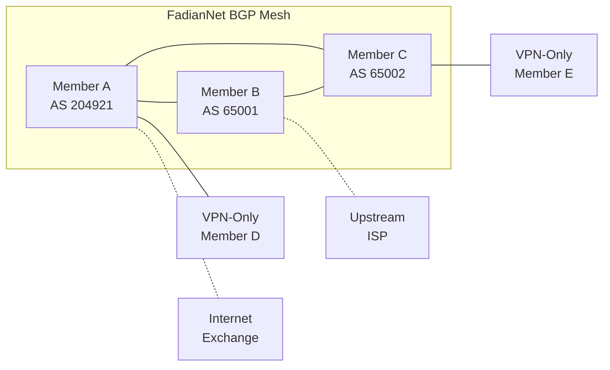

# BGP Integration

BGP members contribute to the FadianNet shared backbone by announcing routes and providing transit.

## Overview

FadianNet BGP creates a mesh of interconnected members that:

- Announce their own IP prefixes to the federation
- Receive routes from other members
- Provide transit for VPN-only members
- Build a resilient, distributed internet backbone

## Architecture

## BGP Configuration

Each BGP Site must configure eBGP peering with the assigned regional Route Reflector using their own ASN. The specific BGP daemon and configuration syntax is up to each member.

### Required Parameters

| Parameter | Value |
|-----------|-------|
| Router ID | Your assigned IP from `172.172.11.0/24` |
| Local AS | Your own ASN |
| Neighbor | Regional RR IP (assigned on join) |
| Hold time | 90s recommended |
| Keepalive | 30s recommended |

### Import Policy

Accept the following routes from FadianNet peers:

- `172.172.10.0/24` — MGMT network
- `172.172.11.0/24` — Loopback network
- `172.172.12.0/16` — P2P links
- Routes tagged with FadianNet community `(65000, 0)`

Reject everything else.

### Export Policy

Announce the following to FadianNet peers:

- Your own prefixes, tagged with community `(65000, 0)`
- MGMT route `172.172.10.0/24` for reachability

### Peer Configuration

Configure one eBGP session per FadianNet peer, using the P2P link addresses from `172.172.12.0/24`.

## Route Types

### Internal Routes

Automatically exchanged between all BGP members:

| Prefix | Purpose |
|--------|---------|
| `172.172.10.0/24` | MGMT network reachability |
| `172.172.11.0/24` | Loopback reachability |
| `172.172.12.0/16` | P2P link reachability |

### Member Prefixes

Each BGP member announces their own public IP prefixes:

- Prefixes must be registered in the member's federation YAML file
- Tagged with FadianNet community `(65000, 0)` on export
- Validated against the federation registry on import

### Transit

Members with upstream connectivity can optionally provide transit:

- Announce a default route (`0.0.0.0/0`) to FadianNet peers
- VPN-only members receive this as their internet gateway
- Transit providers should set appropriate communities

## BGP Communities

| Community | Meaning |
|-----------|---------|
| `(65000, 0)` | Originated within FadianNet |
| `(65000, 1)` | Transit route |
| `(65000, 100)` | Do not export to external peers |
| `(65000, 200)` | Blackhole |

## Monitoring

Verify the following in your BGP daemon:

- eBGP session with regional RR is established
- FadianNet internal routes are received
- Your own prefixes are being announced with the correct community

## Requirements

| Requirement | Details |
|-------------|---------|
| ASN | Public or private (64512–65534 for private) |
| BGP daemon | Any daemon capable of eBGP |
| IP prefix | At least one routable prefix |
| WireGuard tunnels | One per BGP peer |
| Public IP | Required for endpoint reachability |
