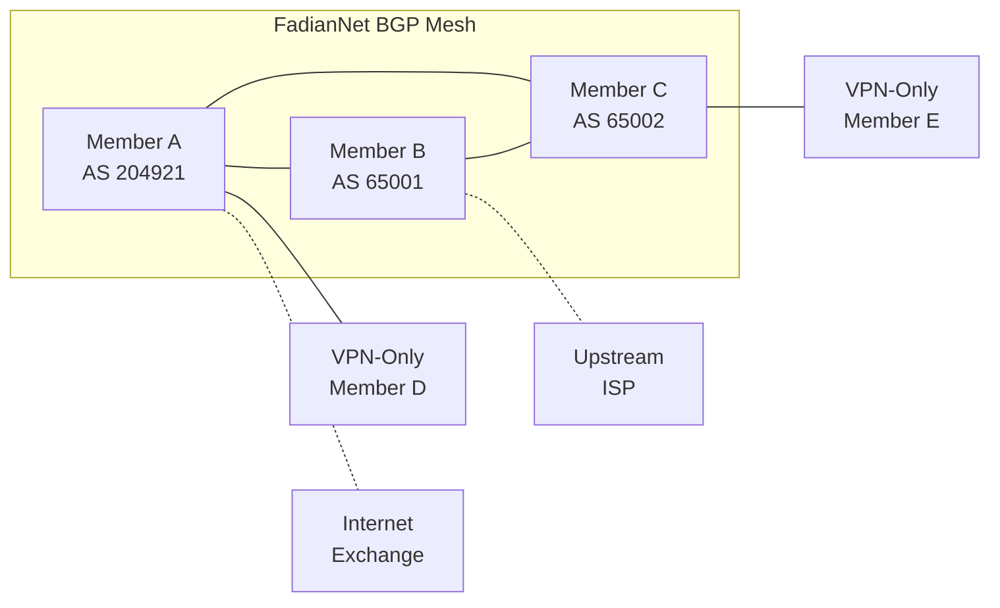

# BGP Integration

BGP members contribute to the FadianNet shared backbone by announcing routes and providing transit.

## Overview

FadianNet BGP creates a mesh of interconnected members that:

- Announce their own IP prefixes to the federation
- Receive routes from other members
- Provide transit for VPN-only members
- Build a resilient, distributed internet backbone

## Architecture



## BGP Configuration

### BIRD 2.x

Recommended BGP daemon for FadianRoam members.

#### Router ID and Loopback

```
router id 172.172.11.X;  # Your assigned loopback from 172.172.11.0/24
```

#### FadianNet BGP Template

```
template bgp fadiannet {
    local as XXXXX;           # Your ASN
    hold time 90;
    keepalive time 30;
    graceful restart on;

    ipv4 {
        import filter fadiannet_import;
        export filter fadiannet_export;
        next hop self;
    };
}
```

#### Import Filter

```
filter fadiannet_import {
    # Accept FadianNet internal routes
    if net ~ [172.172.10.0/24, 172.172.11.0/24, 172.172.12.0/16] then accept;
    
    # Accept member-announced prefixes (validated by federation registry)
    if (65000, 0) ~ bgp_community then accept;
    
    reject;
}
```

#### Export Filter

```
filter fadiannet_export {
    # Announce your own prefixes
    if source = RTS_STATIC then {
        bgp_community.add((65000, 0));  # FadianNet origin community
        accept;
    }
    
    # Announce MGMT route for reachability
    if net = 172.172.10.0/24 then accept;
    
    reject;
}
```

#### Peer Configuration

```
protocol bgp fadiannet_peer_b from fadiannet {
    neighbor 172.172.12.2 as YYYYY;  # Peer's ASN
    description "FadianNet - Member B";
    
    interface "fadiannet-peer-b";
}
```

### FRRouting

Alternative BGP daemon configuration:

```
router bgp XXXXX
 bgp router-id 172.172.11.X
 no bgp default ipv4-unicast
 
 neighbor fadiannet peer-group
 neighbor fadiannet remote-as external
 
 neighbor 172.172.12.2 peer-group fadiannet
 
 address-family ipv4 unicast
  neighbor fadiannet activate
  neighbor fadiannet soft-reconfiguration inbound
  network 203.0.113.0/24
 exit-address-family
```

## Route Types

### Internal Routes

Automatically exchanged between all BGP members:

| Prefix | Purpose |
|--------|---------|
| `172.172.10.0/24` | MGMT network reachability |
| `172.172.11.0/24` | Loopback reachability |
| `172.172.12.0/16` | P2P link reachability |

### Member Prefixes

Each BGP member announces their own public IP prefixes:

- Prefixes must be registered in the member's federation YAML file
- Tagged with FadianNet community `(65000, 0)` on export
- Validated against the federation registry on import

### Transit

Members with upstream connectivity can optionally provide transit:

- Announce a default route (`0.0.0.0/0`) to FadianNet peers
- VPN-only members receive this as their internet gateway
- Transit providers should set appropriate communities

## BGP Communities

| Community | Meaning |
|-----------|---------|
| `(65000, 0)` | Originated within FadianNet |
| `(65000, 1)` | Transit route |
| `(65000, 100)` | Do not export to external peers |
| `(65000, 200)` | Blackhole |

## Monitoring

### BIRD

```bash
birdc show protocols all fadiannet_*
birdc show route protocol fadiannet_peer_b
birdc show route where net = 172.172.11.0/24
```

### FRRouting

```bash
vtysh -c "show bgp summary"
vtysh -c "show bgp ipv4 unicast"
vtysh -c "show bgp neighbors 172.172.12.2"
```

## Requirements

| Requirement | Details |
|-------------|---------|
| ASN | Public or private (64512–65534 for private) |
| BGP daemon | BIRD 2.x or FRRouting |
| IP prefix | At least one routable prefix |
| WireGuard tunnels | One per BGP peer |
| Public IP | Required for endpoint reachability |
