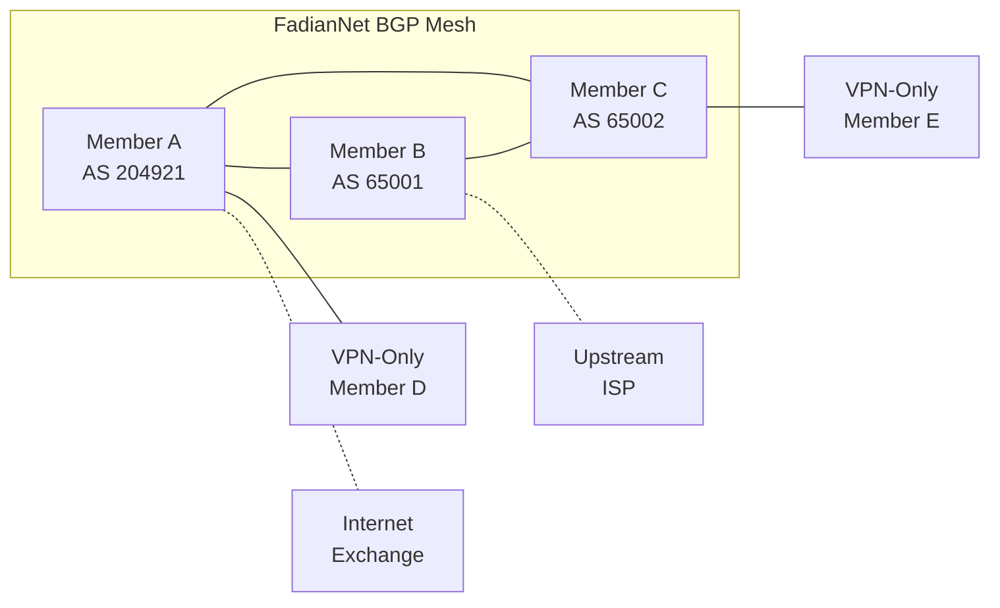

# BGP 集成

BGP 成员通过宣告路由和提供中转来参与 FadianNet 共享骨干网的建设。

## 概述

FadianNet BGP 创建一个互联的成员网格，其功能包括：

- 向联盟宣告自有 IP 前缀
- 接收其他成员的路由
- 为仅 VPN 成员提供中转
- 构建弹性、分布式的互联网骨干

## 架构

## BGP 配置

每个 BGP 站点必须使用自有 ASN 配置与分配的区域 Route Reflector 之间的 eBGP 对等。具体的 BGP 守护进程和配置语法由各成员自行决定。

### 必需参数

| 参数 | 值 |
|------|-----|
| Router ID | 从 `172.172.11.0/24` 分配的 IP |
| Local AS | 你自己的 ASN |
| Neighbor | 区域 RR 的 IP（加入时分配） |
| Hold time | 建议 90 秒 |
| Keepalive | 建议 30 秒 |

### 导入策略

从 FadianNet 对等方接受以下路由：

- `172.172.10.0/24` — MGMT 网络
- `172.172.11.0/24` — Loopback 网络
- `172.172.12.0/16` — P2P 链路
- 带有 FadianNet community `(65000, 0)` 标记的路由

拒绝其他所有路由。

### 导出策略

向 FadianNet 对等方宣告以下路由：

- 你自有的前缀，带有 community `(65000, 0)` 标记
- MGMT 路由 `172.172.10.0/24` 以确保可达性

### 对等配置

为每个 FadianNet 对等方配置一个 eBGP 会话，使用 `172.172.12.0/24` 中的 P2P 链路地址。

## 路由类型

### 内部路由

在所有 BGP 成员之间自动交换：

| 前缀 | 用途 |
|------|------|
| `172.172.10.0/24` | MGMT 网络可达性 |
| `172.172.11.0/24` | Loopback 可达性 |
| `172.172.12.0/16` | P2P 链路可达性 |

### 成员前缀

每个 BGP 成员宣告自有的公共 IP 前缀：

- 前缀必须在成员的联盟 YAML 文件中注册
- 导出时带有 FadianNet community `(65000, 0)` 标记
- 导入时根据联盟注册表进行验证

### 中转

拥有上游连接的成员可以选择性提供中转服务：

- 向 FadianNet 对等方宣告默认路由（`0.0.0.0/0`）
- 仅 VPN 成员将其作为互联网网关接收
- 中转提供方应设置适当的 community

## BGP Community

| Community | 含义 |
|-----------|------|
| `(65000, 0)` | 源自 FadianNet 内部 |
| `(65000, 1)` | 中转路由 |
| `(65000, 100)` | 不导出至外部对等方 |
| `(65000, 200)` | 黑洞路由 |

## 监控

在你的 BGP 守护进程中验证以下内容：

- 与区域 RR 的 eBGP 会话已建立
- 已接收到 FadianNet 内部路由
- 你自有的前缀正以正确的 community 进行宣告

## 要求

| 要求 | 详情 |
|------|------|
| ASN | 公有或私有（私有 ASN 范围：64512–65534） |
| BGP 守护进程 | 任何支持 eBGP 的守护进程 |
| IP 前缀 | 至少一个可路由前缀 |
| WireGuard 隧道 | 每个 BGP 对等方一条 |
| 公网 IP | endpoint 可达性所需 |
